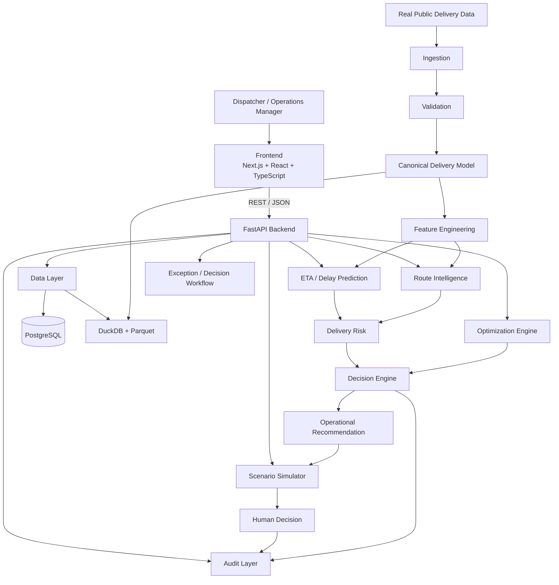
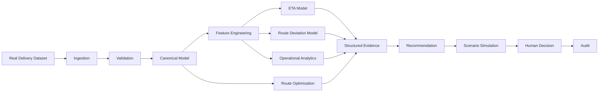
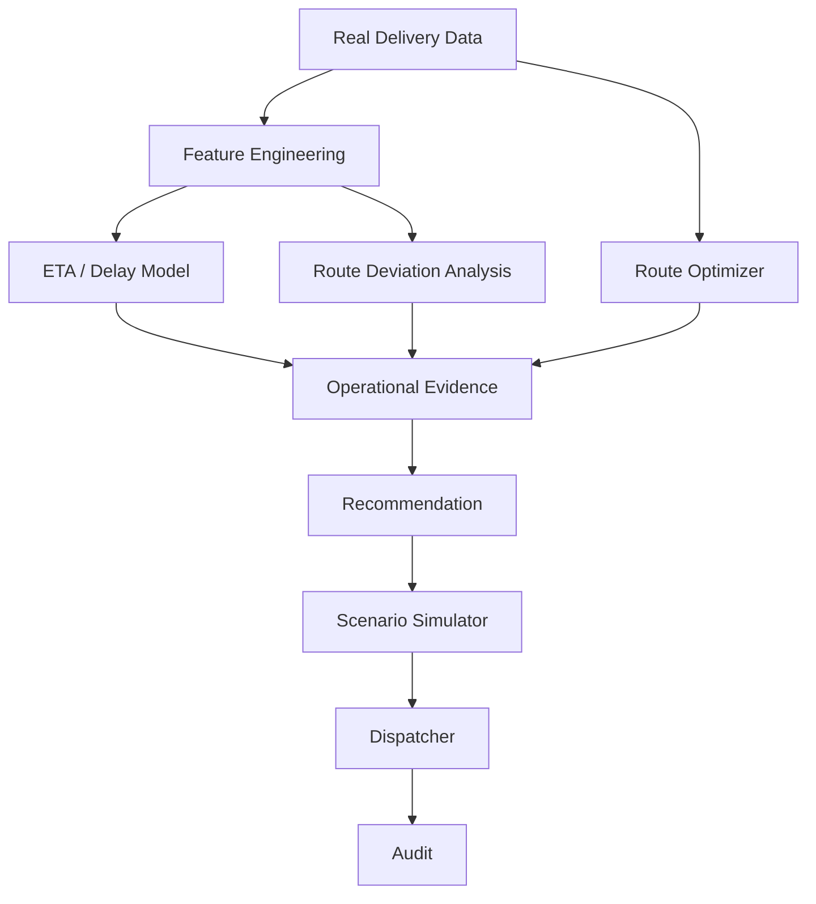

# LastMile Delivery Intelligence — Antigravity Master Build Prompt

## Purpose

Build **LastMile Delivery Intelligence**, a production-quality last-mile logistics decision-intelligence platform for e-commerce, food delivery, courier, pharmacy, and on-demand delivery operations.

The system must demonstrate:

- real-world delivery data engineering
- ETA prediction
- route performance analysis
- route deviation analysis
- delivery-risk prediction
- operational intelligence
- vehicle/driver utilization analysis
- route optimization
- what-if simulation
- human-in-the-loop dispatch decisions
- explainable ML
- optimization algorithms
- measurable business impact

This is **not** a generic logistics dashboard.

The core system must answer:

> Which deliveries/routes are at risk, why are they at risk, what operational action should be taken, and what is the expected impact?

Core loop:

**OBSERVE → PREDICT → DIAGNOSE → OPTIMIZE → SIMULATE → DECIDE → LEARN**

---

# 1. Product Vision

LastMile Delivery Intelligence helps a delivery operator answer:

1. Which deliveries are likely to be late?
2. Which routes are likely to deviate from plan?
3. Why is a route underperforming?
4. Which drivers/routes/stops are causing operational problems?
5. Where is travel-time uncertainty highest?
6. Which route should be changed?
7. Should a delivery be reassigned, resequenced, or escalated?
8. What is the expected impact of the change?
9. How much distance/time/cost can be saved?
10. How does the actual route compare with the planned route?
11. Which operational patterns repeatedly create failures?
12. What should the dispatcher do next?

The product should feel relevant to businesses such as:

- Swiggy
- Zomato
- Amazon
- Flipkart
- Delhivery
- DHL
- FedEx
- UPS
- pharmaceutical distributors
- grocery delivery companies
- courier networks

Do not claim integration with any of these companies.

The product is a general last-mile operations platform demonstrated using real public datasets.

---

# 2. Core Product Modules

Build five connected capabilities.

## A. Delivery Risk

Predict:

- late delivery risk
- route completion risk
- stop-level delay risk

## B. Route Intelligence

Compare:

- planned route
- actual route
- travel distance
- travel time
- stop sequence
- route deviation

## C. Dispatch Intelligence

Recommend:

- resequencing
- route changes
- delivery reassignment where the data supports it
- escalation
- priority handling

## D. Route Optimization

Solve:

- Vehicle Routing Problem
- route sequencing
- time-window constraints
- vehicle capacity constraints where supported
- travel-time uncertainty

## E. Operational Analytics

Track:

- on-time delivery rate
- average delivery time
- route efficiency
- distance efficiency
- driver deviation
- stop-level delay
- route completion
- utilization
- exception rate

---

# 3. Absolute Engineering Principles

## Simplicity over ceremony

Use the simplest architecture that solves the problem.

Do not create artificial abstractions.

Avoid unnecessary:

- BaseService
- BaseRepository
- GenericOptimizer
- GenericAgent
- AbstractRouteEngine
- Manager layers
- utility modules with one function

unless there is a real repeated use case.

## Minimum file count

Every file must have a clear purpose.

Do not create:

```text
route_optimizer_final.py
route_optimizer_final_v2.py
route_optimizer_new.py
eta_model_old.py
eta_model_final.py
utils2.py
temp.py
debug.py
old/
backup/
```

Remove unused files, dependencies, and dead code.

## Clean repository

The repository should look deliberately designed by a strong software engineer.

## Frontend/backend separation

Use a clean monorepo.

## No fake enterprise complexity

Do not introduce:

- Kubernetes
- Kafka
- microservices
- service meshes
- distributed databases

unless the actual system requires them.

The MVP must run locally using:

```bash
docker compose up
```

---

# 4. SYSTEM ARCHITECTURE

Use a **modular monolith**.



---

# 5. Core Data Flow



---

# 6. Real Dataset Policy — ABSOLUTE

## DO NOT GENERATE SYNTHETIC DELIVERY DATA AS A SUBSTITUTE FOR REAL DATA.

The primary workflows must use real public delivery/logistics datasets.

Synthetic data may ONLY be used for isolated unit tests or UI edge cases.

It must never be used for:

- model training
- final evaluation
- route optimization benchmarks
- reported ETA accuracy
- reported route-performance metrics
- business-impact claims
- screenshots presented as real results

If the required real dataset is not present locally:

1. Stop the data-dependent workflow.
2. Display a clear setup instruction.
3. Tell the user which dataset is required.
4. Tell the user where to place/download it.
5. Do not silently fabricate replacement delivery records.

A test fixture must be labelled:

`SYNTHETIC TEST FIXTURE — NOT REAL DELIVERY DATA`

---

# 7. PRIMARY REAL DATASETS

Use **two real public datasets**, because they support different parts of the product.

## Dataset A — Amazon Last Mile Routing Research Challenge

Primary source:

https://registry.opendata.aws/amazon-last-mile-challenges/

This is the preferred dataset for:

- route-level modeling
- stop-level analysis
- package-level analysis
- route planning
- route optimization
- historical route learning

The official AWS registry describes the dataset as containing route-, stop-, and package-level features from **9,184 historical Amazon driver routes performed in 2018 across five U.S. metropolitan areas**.

Use it as the primary benchmark for route intelligence and optimization.

Do not claim the data represents current Amazon operations.

It is historical research data.

## Dataset B — Planned vs Actual Last-Mile Routes

Primary source:

https://data.mendeley.com/datasets/kkwgfvmtxn

DOI:

https://doi.org/10.17632/kkwgfvmtxn.1

This dataset contains planned routes and routes actually driven by drivers, including:

- route identifiers
- stop sequences
- driver identifiers
- timing
- distances
- time-window information

Use it primarily for:

- planned-vs-actual route analysis
- route deviation prediction
- driver behavior analysis
- route efficiency
- deviation explanations

The dataset is licensed under CC BY 4.0 according to its Mendeley Data record.

Do not claim these are Amazon/Indian food-delivery routes.

They are real logistics-company data released for research.

---

# 8. OPTIONAL THIRD DATASET — LaDe

If additional scale is useful, optionally support:

**LaDe — Large-scale Last-mile Delivery Dataset**

Dataset homepage:

https://huggingface.co/datasets/Cainiao-AI/LaDe

Research paper:

https://arxiv.org/abs/2306.10675

LaDe contains millions of packages and courier/task-event information from real-world industry operations.

Use it only if the additional scale materially improves the system.

Do not add it merely to make the project appear larger.

The MVP can be completed using the two primary datasets above.

---

# 9. DATA PROVENANCE

For every imported dataset record:

- dataset name
- source URL
- DOI if available
- license
- dataset version
- download timestamp
- file hash
- row count
- date range
- geographic scope
- schema
- validation status

`docs/DATA.md` must state exactly which datasets were used for every reported experiment.

A reviewer must be able to answer:

> "Exactly which real data did you use?"

without asking the developer.

---

# 10. DATA INGESTION

Support:

- CSV
- Parquet
- XLSX where the selected public dataset requires it

Pipeline:

```text
RAW DATA
↓
Schema Detection
↓
Validation
↓
Normalization
↓
Canonical Delivery Model
↓
Parquet / DuckDB
```

Never silently modify source data.

---

# 11. Canonical Delivery Model

Normalize the different datasets into a common internal representation.

Where available:

## Route

- route_id
- driver_id
- vehicle_id
- depot
- route_date
- planned_distance
- actual_distance
- planned_duration
- actual_duration

## Stop

- stop_id
- route_id
- sequence
- location
- arrival_time
- planned_arrival
- service_time
- time_window
- demand/package information

## Package

- package_id
- stop_id
- weight
- volume
- delivery requirement
- priority where available

## Travel

- origin
- destination
- distance
- expected travel time
- actual travel time
- traffic scenario where available

Do not invent fields that do not exist in the source dataset.

Use nullable fields when the source does not provide a dimension.

---

# 12. Data Quality

Validate:

- required columns
- data types
- missing values
- duplicates
- invalid timestamps
- impossible durations
- negative distances
- invalid route sequences
- inconsistent IDs
- missing route relationships
- malformed coordinates where applicable

Produce:

`DataQualityReport`

Example:

```text
Rows:
Routes:
Stops:
Drivers:
Missing values:
Duplicate records:
Invalid durations:
Invalid distances:
Validation status:
```

All values must be calculated from the actual dataset.

---

# 13. Delivery Analytics

Implement:

## Delivery performance

- on-time delivery rate
- late delivery rate
- average delay
- median delay
- P90 delay
- P95 delay
- delivery duration

## Route performance

- planned distance
- actual distance
- distance variance
- planned duration
- actual duration
- duration variance
- route efficiency

## Driver performance

Where supported:

- route completion
- average delay
- route deviation
- stop efficiency
- distance efficiency

Do not turn these into simplistic driver rankings without controlling for route difficulty.

---

# 14. Route Deviation Intelligence

This is a flagship capability.

For every route calculate:

```text
Planned Route
vs
Actual Route
```

Measure:

- sequence similarity
- stop-order changes
- additional distance
- additional time
- route deviation percentage
- delayed stops
- skipped/reordered stops where observable

Show:

```text
Planned:
Depot → A → B → C → D → Depot

Actual:
Depot → A → C → B → D → Depot

Deviation:
B and C reordered

Distance impact:
+X%

Duration impact:
+Y%
```

All values must come from the real data.

---

# 15. ETA / Delay Prediction

Build a supervised model where the dataset supports an appropriate target.

Possible targets:

```text
delay_minutes
late_delivery
route_completion_delay
stop_arrival_delay
```

Do not force an ETA model onto a dataset that lacks the required temporal information.

If the selected dataset supports route/stop timing, train a delay/ETA model.

---

# 16. ETA Feature Engineering

Potential features:

## Route features

- planned route duration
- planned distance
- number of stops
- cumulative route distance
- remaining stops

## Stop features

- stop sequence
- service time
- time window
- package count
- package weight/volume where available

## Historical features

Where valid:

- historical route delay
- historical driver route deviation
- historical stop delay

## Temporal

- hour
- day
- route position
- elapsed route time

## Travel

- planned travel time
- distance
- traffic scenario where available

Do not use future information.

---

# 17. Temporal Leakage Rule

For a prediction at time `T`:

Allowed:

```text
data <= T
```

Forbidden:

```text
data > T
```

Never use:

- future stops
- future actual arrival times
- future route outcomes
- future driver behavior

to construct a feature for a prediction made earlier.

Use temporal splits.

Do not randomly shuffle sequential delivery records when doing so introduces leakage.

Document leakage prevention in `docs/ML.md`.

---

# 18. ETA Model Development

Progressively build:

### Baseline

Historical/route-level average.

### Baseline 2

Linear/regularized regression.

### Candidate

Gradient-boosted regression model such as:

- XGBoost
- LightGBM
- HistGradientBoosting

Only use the more complex model if it improves held-out performance.

Evaluate:

- MAE
- RMSE
- median absolute error
- P90 absolute error
- bias

If predicting late/not-late:

- precision
- recall
- F1
- PR-AUC

---

# 19. Route Deviation Prediction

Where the planned-vs-actual dataset supports it, predict:

```text
Will the driver materially deviate from the planned route?
```

Target can be defined from actual-vs-planned route divergence.

Possible features:

- route length
- number of stops
- time-window pressure
- planned duration
- route complexity
- historical driver deviation
- stop density

Do not use actual future route information in prediction features.

---

# 20. Risk Scoring

Create a delivery risk score:

```text
0 → 100
```

Possible components:

- ETA delay probability
- predicted delay magnitude
- route deviation probability
- time-window pressure
- route complexity
- historical operational risk

The risk score must be reproducible.

Example:

```text
0–20    LOW
21–50   MEDIUM
51–75   HIGH
76–100  CRITICAL
```

Thresholds must be configurable and evaluated.

Do not claim the score is universally optimal.

---

# 21. Operational Decision Engine

Do not stop at prediction.

Use:

```text
Risk
+
Route State
+
Operational Constraints
+
Available Options
=
Recommendation
```

Possible actions:

- monitor
- resequence
- reroute
- reassign
- prioritize stop
- escalate
- continue as planned

Only recommend an action if the required operational information exists.

Never recommend reassignment if the system has no vehicle/driver availability data.

---

# 22. Route Optimization Engine

Implement a genuine optimization component.

Model appropriate variants of:

- Vehicle Routing Problem
- Traveling Salesperson Problem
- Vehicle Routing Problem with Time Windows
- capacity-constrained routing where capacity data exists

Use:

- OR-Tools
- heuristic search
- local search
- insertion heuristics

Do not use an LLM to calculate routes.

---

# 23. Optimization Objective

Make objectives explicit.

Possible objective:

```text
minimize:

travel distance cost
+
travel time cost
+
late-delivery penalty
+
time-window violation penalty
+
route imbalance penalty
```

All weights must be configurable.

Do not hide optimization weights inside code.

---

# 24. Route Optimization Constraints

Support where data permits:

- depot
- vehicle count
- vehicle capacity
- package demand
- time windows
- service time
- maximum route duration
- delivery priority

The system must clearly state which constraints are actually supported by the selected dataset.

---

# 25. Scenario Simulator

This is a flagship product feature.

Allow:

### Scenario A

"What if we reorder these stops?"

### Scenario B

"What if we remove one high-delay stop from this route?"

### Scenario C

"What if we use two vehicles instead of one?"

### Scenario D

"What if time-window priority is increased?"

### Scenario E

"What if the route is optimized for time instead of distance?"

Show:

- route distance
- route duration
- estimated late deliveries
- time-window violations
- number of vehicles
- objective value
- improvement vs baseline

Every result must be computed.

Do not fabricate savings.

---

# 26. Planned vs Optimized vs Actual

For a route, show three states:

```text
PLANNED
   ↓
OPTIMIZED
   ↓
ACTUAL
```

Example:

```text
Metric             Planned    Optimized    Actual
--------------------------------------------------
Distance             X km       Y km        Z km
Duration             X min      Y min       Z min
Late Stops             X          Y           Z
Deviation              -          -          X%
```

This is one of the strongest visual stories in the product.

---

# 27. Route Investigation Workspace

A dispatcher should be able to open a route and see:

## What happened?

Route performance.

## Why?

Top contributing factors.

## What changed?

Planned vs actual.

## What is at risk?

Stops likely to become late.

## What can be done?

Ranked operational actions.

## What happens if we act?

Scenario simulation.

---

# 28. Driver Intelligence

If driver identifiers and sufficient history exist:

Show:

- route adherence
- historical deviation
- average delay
- route difficulty-adjusted performance where feasible

Do NOT create simplistic "best driver/worst driver" rankings.

A driver completing difficult routes should not automatically be labelled poor.

Explain context.

---

# 29. Dashboard

Navigation:

```text
Overview
Routes
Delivery Risk
Route Deviations
Investigations
Optimization
Scenarios
Drivers
Models
Data Quality
Settings
```

Overview:

- on-time rate
- late rate
- average delay
- P95 delay
- route efficiency
- route deviation rate
- high-risk routes
- optimization opportunities

---

# 30. Map View

If coordinates/location information is available:

Display:

- depot
- planned route
- actual route
- optimized route
- stops
- delayed stops
- high-risk stops

Use a map library appropriate for the application.

Do not expose personally identifiable address information.

If the public dataset contains anonymized or transformed locations, preserve that privacy.

---

# 31. API

Implement:

```text
GET  /health

POST /datasets/ingest
GET  /datasets

GET  /routes
GET  /routes/{id}

GET  /routes/{id}/performance
GET  /routes/{id}/deviation

GET  /deliveries
GET  /deliveries/{id}

POST /deliveries/predict-risk
POST /routes/predict-risk

POST /routes/{id}/optimize
POST /routes/{id}/simulate

GET  /recommendations
GET  /recommendations/{id}

GET  /drivers
GET  /drivers/{id}

GET  /models
GET  /metrics

GET  /data-quality
GET  /audit
```

---

# 32. Database

Use PostgreSQL for application state.

Tables:

- users
- datasets
- ingestion_runs
- routes
- stops
- deliveries
- drivers
- predictions
- route_metrics
- deviations
- optimization_runs
- recommendations
- scenario_runs
- model_versions
- model_metrics
- audit_logs

Do not duplicate large raw datasets unnecessarily.

Use Parquet/DuckDB for analytical workloads where appropriate.

---

# 33. Authentication

Roles:

- ADMIN
- DISPATCHER
- OPERATIONS_MANAGER
- ANALYST
- VIEWER

Implement:

- authentication
- authorization
- audit logging
- secure environment variables
- input validation

---

# 34. Auditability

For every recommendation record:

- route ID
- dataset
- model version
- feature version
- risk score
- evidence
- optimization parameters
- recommendation
- scenario result
- user decision
- timestamp

The system must answer:

> Why did the system recommend changing this route?

---

# 35. Model Monitoring

Monitor:

- feature drift
- prediction distribution
- missing features
- latency
- model version
- ETA error
- late-delivery classification performance
- route-deviation prediction performance

If labels arrive later, support delayed performance evaluation.

Do not claim live production monitoring.

---

# 36. Evaluation

## ETA

Evaluate:

- MAE
- RMSE
- median absolute error
- P90 error
- bias

## Risk classification

Evaluate:

- precision
- recall
- F1
- PR-AUC

## Route optimization

Compare:

```text
Original route
vs
Optimized route
```

Metrics:

- distance
- duration
- late deliveries
- time-window violations
- objective value

## Route deviation

Evaluate:

- precision
- recall
- F1
- PR-AUC

---

# 37. Optimization Evaluation

Do not simply show:

> "Optimized route is 20% better."

Measure:

```text
Baseline objective
Optimized objective
Absolute improvement
Percentage improvement
Computation time
Constraints satisfied
```

Verify that optimized routes remain feasible.

---

# 38. Historical Replay

For a route at time `T`:

Use only information available at `T`.

Then:

```text
Predict
→ Recommend
→ Optimize
→ Compare with actual outcome
```

This is mandatory for credible evaluation.

---

# 39. Reproducibility

Every experiment must record:

- dataset
- dataset version
- feature version
- model version
- optimization parameters
- train period
- validation period
- test period
- random seed
- metrics

A reviewer must be able to reproduce the result.

---

# 40. No Fake Claims

Never fabricate:

- delivery improvement
- cost savings
- driver performance
- ETA accuracy
- route efficiency
- production deployment
- company integration
- number of deliveries
- customer count

If simulated:

`SIMULATED`

If synthetic:

`SYNTHETIC TEST FIXTURE`

If public real data:

`PUBLIC REAL-WORLD DATA`

If not measured:

`NOT YET MEASURED`

---

# 41. Demo Mode

Run locally:

```bash
docker compose up
```

Demo flow:

1. Load real public dataset
2. Validate dataset
3. Open dashboard
4. Select route
5. Show planned vs actual
6. Show risk
7. Show route deviation
8. Show explanation
9. Run optimizer
10. Compare routes
11. Run scenario
12. Show operational recommendation
13. Record decision
14. Show audit

Do not create fake production-looking numbers.

---

# 42. Synthetic Test Fixtures

Synthetic data may exist only for:

- unit tests
- malformed-data tests
- empty states
- UI edge cases
- API validation tests

It must never enter:

- training
- final evaluation
- reported metrics
- benchmark comparisons
- business-impact calculations

Label it clearly:

`SYNTHETIC TEST FIXTURE — NOT REAL DELIVERY DATA`

---

# 43. Documentation

Keep documentation small.

Required:

```text
README.md
docs/ARCHITECTURE.md
docs/PRODUCT.md
docs/DATA.md
docs/ML.md
docs/OPTIMIZATION.md
docs/EVALUATION.md
docs/LIMITATIONS.md
```

## PRODUCT.md

Include:

- problem
- users
- value proposition
- MVP
- non-goals
- user journeys
- requirements
- success metrics
- risks
- assumptions
- roadmap

## DATA.md

Include:

- exact datasets
- source links
- license
- schema
- provenance
- preprocessing
- known limitations

## ML.md

Include:

- feature engineering
- temporal split
- leakage prevention
- models
- training
- calibration if used
- evaluation

## OPTIMIZATION.md

Include:

- mathematical objective
- constraints
- solver
- heuristics
- baseline
- evaluation

---

# 44. Development Phases

### Phase 0
Repository setup

### Phase 1
Real dataset ingestion

### Phase 2
Validation + canonical model

### Phase 3
Operational analytics

### Phase 4
Route deviation analysis

### Phase 5
ETA/delay prediction

### Phase 6
Risk scoring

### Phase 7
Route optimization

### Phase 8
Scenario simulator

### Phase 9
Recommendation engine

### Phase 10
Backend API

### Phase 11
Frontend

### Phase 12
Map/route visualization

### Phase 13
Testing

### Phase 14
Historical replay

### Phase 15
Evaluation

### Phase 16
Documentation

### Phase 17
Final repository cleanup

After each phase:

- run tests
- fix errors
- remove unnecessary code
- update documentation

---

# 45. Git Discipline

Use meaningful commits:

```text
feat: add real delivery dataset ingestion
feat: add route performance analytics
feat: add route deviation analysis
feat: add delay prediction
feat: add delivery risk scoring
feat: add route optimizer
feat: add scenario simulator
feat: add dispatcher workspace
test: add temporal replay
docs: document optimization model
```

Avoid giant meaningless commits.

---

# 46. Final Demonstration

Target 5–10 minutes.

1. Open operations dashboard
2. Show delivery KPIs
3. Open a route
4. Show planned route
5. Show actual route
6. Highlight deviations
7. Show delivery-risk prediction
8. Explain risk
9. Run optimization
10. Compare planned vs optimized vs actual
11. Run scenario
12. Show estimated operational impact
13. Show recommendation
14. Accept/reject recommendation
15. Show audit trail

---

# 47. Final Validation

Actually:

- run backend
- run frontend
- download/use real public datasets
- validate data
- run analytics
- train/load models
- generate predictions
- run route optimizer
- run scenarios
- verify constraints
- run historical replay
- run tests
- verify API
- verify UI
- test missing data
- test invalid routes
- test model failure
- test optimizer infeasibility
- test empty states
- clean repository

Do not declare completion until the complete workflow works.

---

# 48. Model Training Strategy

## Do NOT train an LLM.

The core intelligence should come from:

- supervised ML
- statistical analysis
- optimization
- deterministic business rules

An LLM is optional and should only be used for natural-language explanations or summarization if it adds genuine value.

---

# 49. ETA / Delay Model Training

If the selected dataset supports a valid delay/ETA target:

```text
Real Historical Delivery Data
        ↓
Validation
        ↓
Temporal Split
        ↓
Feature Engineering
        ↓
Baseline
        ↓
Candidate Model
        ↓
Validation
        ↓
Unseen Test
        ↓
Model Version
        ↓
Inference
```

Candidate models:

- linear regression
- random forest
- gradient boosting
- XGBoost / LightGBM if justified

Start simple.

Keep the complex model only if it materially improves held-out performance.

---

# 50. Route Deviation Model

For planned-vs-actual route data:

Construct a target such as:

```text
material_route_deviation = 0 / 1
```

based on an explicitly documented deviation definition.

Potential features:

- route length
- stop count
- time-window pressure
- planned duration
- route complexity
- historical driver deviation
- stop density
- travel-time characteristics

Do not use future actual route information as an input.

---

# 51. Optimization Is Not Model Training

Route optimization is primarily an operations-research problem.

Use:

- OR-Tools
- VRP formulations
- heuristics
- local search
- insertion methods

Do not train an ML model just to produce a route unless a measurable learning-based routing component is genuinely justified.

The optimization engine should be deterministic and reproducible.

---

# 52. Model Evaluation Rules

A model is not better because it is more complex.

ETA:

> The candidate model must beat or materially improve upon the baseline on an unseen temporal test period.

Route deviation:

> The model must improve useful precision/recall tradeoffs over the baseline.

Optimization:

> The optimized route must remain feasible and improve the explicitly defined objective compared with the baseline.

If complexity does not improve measurable performance:

**keep the simpler method.**

---

# 53. Leakage Prevention

For a prediction at time `T`:

Allowed:

```text
information <= T
```

Forbidden:

```text
information > T
```

Do not:

- calculate future-aware rolling features
- use actual future arrival times
- use future route completion
- use future route deviations
- use future driver behavior
- randomly mix future and past routes when temporal leakage results

Document the leakage strategy in `docs/ML.md`.

---

# 54. Final Product Philosophy

The correct architecture is:

```text
REAL DELIVERY DATA
        ↓
DATA ENGINEERING
        ↓
OPERATIONAL ANALYTICS
        ↓
ML PREDICTION
        ↓
ROUTE / RISK INTELLIGENCE
        ↓
OPTIMIZATION
        ↓
SCENARIO SIMULATION
        ↓
HUMAN DECISION
        ↓
AUDIT
```

Not:

```text
CSV
 ↓
LLM
 ↓
"Here is the best route"
```

The project should demonstrate genuine engineering judgment at the intersection of:

**LOGISTICS + ML + OPTIMIZATION + PRODUCT + SOFTWARE ENGINEERING**

The final repository should be small, clean, understandable, reproducible, and technically defensible.

---

# GITHUB / README QUALITY REQUIREMENT — MANDATORY

This project will be published publicly on GitHub.

The `README.md` must be treated as a first-class product artifact.

It must be polished enough for:

- recruiters
- hiring managers
- software engineers
- ML engineers
- operations researchers
- logistics professionals
- product managers

to understand the project without opening the source code.

## Required README structure

Use:

1. Project title
2. One-line value proposition
3. Badges
4. Problem statement
5. Why last-mile delivery is difficult
6. What the product does
7. Key capabilities
8. Architecture
9. Architecture diagram
10. End-to-end data flow
11. Real datasets and provenance
12. Data model
13. Delivery analytics
14. ETA/delay prediction
15. Route deviation intelligence
16. Optimization formulation
17. Scenario simulation
18. Planned vs optimized vs actual workflow
19. Screenshots / GIFs
20. Example route investigation
21. Evaluation methodology
22. Actual evaluation results
23. Reproducibility
24. Quick start
25. Dataset setup
26. Model training
27. Optimization execution
28. Tests
29. Project structure
30. API overview
31. Security / privacy
32. Limitations
33. Real vs simulated data
34. Future roadmap
35. Author / contact

## Writing style

Do not write generic AI marketing copy.

Avoid unsupported phrases such as:

- revolutionary
- cutting-edge
- game-changing
- next-generation
- AI-powered logistics platform
- enterprise-grade

Prefer concrete engineering descriptions.

Example:

> "LastMile Delivery Intelligence compares planned and actual routes, predicts delivery delay risk, and uses a constraint-aware routing optimizer to evaluate alternative stop sequences."

## Architecture explanation

Include:

### Why ML + optimization?

Explain:

- ML predicts uncertain outcomes such as delay
- deterministic analytics measures actual operational performance
- optimization searches for feasible route alternatives
- the decision layer combines prediction, constraints, and operational policy

Make clear that the ML model does not directly generate routes.

## Architecture diagram

Include a Mermaid diagram such as:



Adapt it to the actual implementation.

## Dataset section

The README must explicitly identify the real datasets used.

### Primary dataset 1

**Amazon Last Mile Routing Research Challenge**

Official source:

https://registry.opendata.aws/amazon-last-mile-challenges/

Explain:

- what the dataset contains
- geographic/temporal scope
- route/stop/package information used
- exact subset used
- preprocessing
- limitations

Do not imply current Amazon operational data.

### Primary dataset 2

**Planned vs Actual Last-Mile Routes**

Source:

https://data.mendeley.com/datasets/kkwgfvmtxn

DOI:

https://doi.org/10.17632/kkwgfvmtxn.1

Explain:

- planned routes
- actual routes
- route/stop/driver information
- how deviation is calculated
- preprocessing
- license

### Optional dataset

**LaDe**

https://huggingface.co/datasets/Cainiao-AI/LaDe

Explain only if it is actually used.

Never claim a dataset was used if it was not.

## Real-data policy

The README must clearly distinguish:

**PUBLIC REAL-WORLD DATA**

from:

**SYNTHETIC TEST FIXTURE**

Synthetic data must never be used for:

- ETA training
- route-deviation training
- optimization benchmark
- reported metrics
- business-impact calculations

## Evaluation results

Show actual measurements only.

ETA:

- MAE
- RMSE
- median absolute error
- P90 error
- bias

Route deviation:

- precision
- recall
- F1
- PR-AUC

Optimization:

- baseline distance
- optimized distance
- baseline duration
- optimized duration
- objective value
- improvement
- computation time
- constraint feasibility

Do not invent numbers.

If evaluation has not been run:

> Evaluation results will be populated after the reproducible evaluation pipeline is executed.

## Strong product story

The README should clearly demonstrate:

```text
PLANNED
   ↓
PREDICTED
   ↓
OPTIMIZED
   ↓
ACTUAL
```

Show an example route investigation with actual dataset-derived values.

## Screenshots

After functionality is complete, capture:

1. Operations dashboard
2. Route map
3. Planned vs actual route
4. Delivery-risk view
5. Route investigation
6. Optimization result
7. Scenario simulator
8. Audit/decision view

Only include screenshots that materially improve the repository.

## Quick Start

Provide exact, tested commands.

Example:

```bash
git clone <repository>
cd lastmile-delivery-intelligence
cp .env.example .env
docker compose up --build
```

Then explain actual:

- frontend URL
- backend URL
- API docs
- dataset placement
- ingestion
- model training
- optimizer execution

Never publish commands that have not been tested.

## Reproducibility

Document how a reviewer can reproduce:

1. dataset ingestion
2. validation
3. feature generation
4. model training
5. model evaluation
6. route optimization
7. scenario simulation
8. final comparison

Record:

- dataset
- dataset version
- feature version
- train/test period
- model version
- optimization parameters
- random seed
- evaluation metrics

## API documentation

Include an actual table based on implemented endpoints.

Do not document endpoints that do not exist.

## Project structure

Show the actual final repository structure.

## Privacy

Explain:

- public dataset limitations
- anonymized locations where applicable
- no real customer PII
- no live company integration
- no production dispatch control

## Limitations

Be honest about:

- historical data
- geographic scope
- missing traffic signals
- missing vehicle/driver constraints
- missing live GPS where applicable
- dataset-specific limitations
- model generalization
- optimization assumptions

## GitHub presentation

The first part of the README should communicate:

**Problem → Product → Real Data → Architecture → ML → Optimization → Results → Demo → Setup**

A recruiter should understand the project within a few minutes.

## Final README QA

Before completion:

- render-check Markdown
- verify all dataset links
- verify DOI
- verify commands
- verify screenshots
- verify Mermaid
- verify no fake metrics
- verify no secrets
- verify README matches implementation
- verify repository structure
- verify evaluation claims
- verify dataset provenance

The README is part of the product and must be completed before the project is considered finished.
