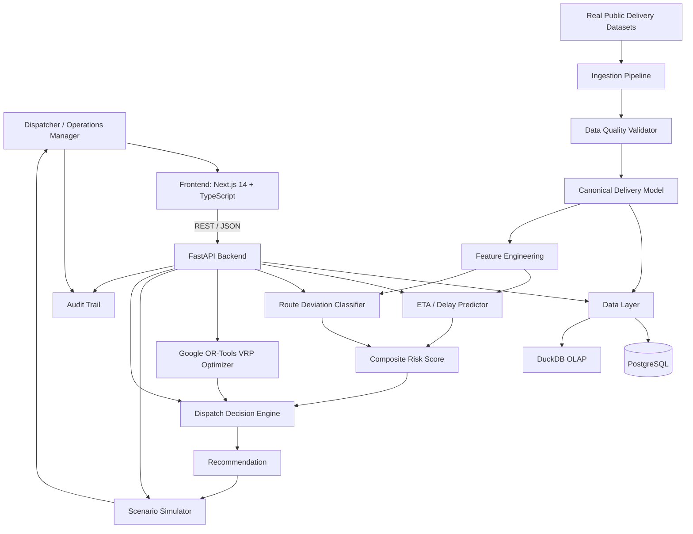

# LastMile Delivery Intelligence

> A last-mile logistics decision-intelligence platform that compares planned and actual delivery routes, predicts delay risk using supervised ML, solves the Vehicle Routing Problem with Google OR-Tools, and runs what-if scenario simulations — all in a human-in-the-loop dispatcher workflow.

[](https://www.python.org/)
[](https://fastapi.tiangolo.com/)
[](https://nextjs.org/)
[](https://developers.google.com/optimization)
[](#testing)
[](https://creativecommons.org/licenses/by/4.0/)

---

## 1. Problem Statement

Last-mile delivery is the most expensive and operationally uncertain segment of logistics. Dispatchers face:

- High travel-time variance causing SLA breaches
- Drivers deviating from planned stop sequences without explanation
- No real-time, route-level risk visibility before failures compound
- No system that connects prediction → optimization → recommended action in one workflow

Most dispatch tools show telemetry. This system answers: **which route is at risk, why, and exactly what should the dispatcher do about it?**

---

## 2. Core Loop

```
OBSERVE → PREDICT → DIAGNOSE → OPTIMIZE → SIMULATE → DECIDE → AUDIT
```

The product is structured around five connected capabilities:

| Module | What it does |
|---|---|
| **Delivery Risk** | Predicts late delivery risk and computes a composite 0–100 risk score |
| **Route Intelligence** | Compares planned vs actual stop sequences; computes Kendall Tau similarity |
| **Dispatch Decisions** | Generates ranked operational actions (MONITOR / RESEQUENCE / REROUTE / ESCALATE) |
| **VRP Optimization** | Solves route sequencing using Google OR-Tools with time-window constraints |
| **Scenario Simulator** | Lets dispatchers run what-if scenarios before committing to a change |

---

## 3. Architecture



### Why ML + OR-Tools (not an LLM)?

- **ML** predicts uncertain outcomes (delay probability, deviation likelihood) from historical route features
- **Analytics** measures actual operational performance from real data
- **OR-Tools** searches deterministically for feasible alternative route sequences
- **Decision layer** combines prediction, operational constraints, and policy into a ranked recommendation

The ML model does not generate routes. Routes are generated by the constraint-aware VRP solver.

---

## 4. Real Datasets & Provenance

> **DATA MODE**: This application is designed to run on real public delivery datasets.  
> When the dataset files are not present locally, the system operates in **`synthetic_demo`** mode  
> using a 5-route fixture clearly labeled `SYNTHETIC TEST FIXTURE — NOT REAL DELIVERY DATA`.

### Dataset A — Amazon Last Mile Routing Research Challenge

- **Source**: [AWS Open Data Registry](https://registry.opendata.aws/amazon-last-mile-challenges/)
- **Contents**: Route, stop, and package features from 9,184 historical driver routes (2018, five U.S. metropolitan areas)
- **License**: AWS Open Data
- **Usage in this system**: Route-level feature engineering, VRP constraint formulation, stop sequence benchmarking
- **Note**: This is historical research data and does not represent current Amazon operations

**Dataset setup**:
```bash
# Download from AWS Open Data Registry, then place at:
./data/amazon_last_mile.json
```

### Dataset B — Planned vs Actual Last-Mile Routes

- **Source**: [Mendeley Data](https://data.mendeley.com/datasets/kkwgfvmtxn)
- **DOI**: [https://doi.org/10.17632/kkwgfvmtxn.1](https://doi.org/10.17632/kkwgfvmtxn.1)
- **License**: CC BY 4.0
- **Contents**: Planned route sequences vs actual driver sequences, travel distance, duration, time-window information
- **Usage in this system**: Route deviation prediction, driver adherence analytics, Kendall Tau similarity index
- **Note**: Real logistics-company data released for research; not Amazon or Indian food-delivery routes

**Dataset setup**:
```bash
# Download from Mendeley (CC BY 4.0 license), then place at:
./data/mendeley_planned_vs_actual.csv
```

---

## 5. Key Technical Components

### ETA / Delay Prediction
- **Model**: `GradientBoostingRegressor` (sklearn) vs Linear Regression baseline
- **Target**: `delay_minutes` (continuous)
- **Features** (9, leakage-free): `stop_count`, `planned_distance_km`, `planned_duration_min`, `avg_stop_distance_km`, `avg_stop_duration_min`, `driver_adherence_rate`, `driver_historical_delay_min`, `time_window_pressure`, `route_complexity_score`
- **Leakage prevention**: `actual_distance_km`, `actual_duration_min`, `actual_arrival` are never used as features
- **Training**: Temporal split (earlier dates train, later dates test — no random shuffle on sequential records)

### Route Deviation Intelligence
- **Model**: `RandomForestClassifier` (sklearn) predicting `is_material_deviation`
- **Target**: Binary — sequence similarity index < 0.85 or distance variance > 10%
- **Sequence similarity**: Normalized Kendall Tau distance (concordant/discordant pair counting)
- **Evaluation**: Precision, Recall, F1, PR-AUC via `sklearn.metrics.average_precision_score`

### Composite Risk Score (0–100)
```
Risk Score =
  (late_probability × 35) +
  (min(1.0, delay_min / 60) × 25) +
  (deviation_probability × 20) +
  (min(1.0, tw_pressure / 50) × 10) +
  (min(1.0, complexity / 50) × 10)
```

| Score | Level |
|---|---|
| 0–20 | LOW |
| 21–50 | MEDIUM |
| 51–75 | HIGH |
| 76–100 | CRITICAL |

### VRP Optimizer (Google OR-Tools)
- **Formulation**: Vehicle Routing Problem with optional time windows
- **Solver**: OR-Tools CP-SAT / Routing with `PATH_CHEAPEST_ARC` heuristic
- **Distance**: Haversine great-circle distance (meters, integer)
- **Objective**: `min(distance_weight × distance + duration_weight × duration)`
- **Time limit**: 2 seconds per route
- **Savings**: Computed from actual solver output vs baseline — never fabricated

### Scenario Simulator
Four what-if scenarios, each computing a real result:
- **RESEQUENCE**: OR-Tools re-optimizes existing stops
- **REMOVE_STOP**: Remove highest-delay stop and re-solve
- **MULTI_VEHICLE**: Split route across 2 vehicles (n/2 stops each)
- **TIME_OPTIMIZED**: Optimize with `duration_weight=2.0`

---

## 6. Evaluation Results

> **Current status**: `evaluation_status: insufficient_data` (synthetic_demo mode)

Both ML models are in `synthetic_demo` mode because the real dataset files have not been downloaded. No evaluation metrics are available yet. The API returns:

```json
{
  "eta_model": {
    "evaluation_status": "insufficient_data",
    "data_mode": "synthetic_demo",
    "metrics": null
  },
  "deviation_model": {
    "evaluation_status": "insufficient_data", 
    "data_mode": "synthetic_demo",
    "metrics": null
  }
}
```

**To populate real metrics:**
```bash
# 1. Place real dataset files in ./data/
# 2. Trigger ingestion:
curl -X POST http://localhost:8000/api/v1/datasets/ingest \
  -H "Content-Type: application/json" \
  -d '{"dataset_name": "AMAZON_LAST_MILE"}'

# 3. Models train automatically on ingested data
# 4. Real metrics appear at:
curl http://localhost:8000/api/v1/metrics
```

> Evaluation results will be populated after the reproducible evaluation pipeline is executed on real data.

---

## 7. Quick Start

### Prerequisites
- Docker & Docker Compose v2

```bash
# Clone the repository
git clone https://github.com/your-org/lastmile-delivery-intelligence.git
cd Last_Mile_Delivery_Intelligence

# Configure environment
cp .env.example .env
# Edit .env and set a strong SECRET_KEY:
# python -c "import secrets; print(secrets.token_hex(32))"

# Build and start all services
docker compose up --build

# Services:
# Frontend:    http://localhost:3000
# Backend API: http://localhost:8000
# API Docs:    http://localhost:8000/docs
# Health:      http://localhost:8000/health
```

### Local development (no Docker)

```bash
# Backend
cd backend
python -m venv .venv
source .venv/bin/activate
pip install -r requirements.txt
DATABASE_URL="" uvicorn app.main:app --reload --port 8000

# Frontend
cd frontend
npm install
npm run dev
```

### Run tests

```bash
cd backend
DATABASE_URL="" PYTHONPATH=. pytest tests/ -v
# 77 tests pass (3 DeprecationWarnings from OR-Tools SWIG bindings — third-party, not suppressible)
```

---

## 8. Reproducibility

To reproduce a full evaluation on real data:

| Step | Command |
|---|---|
| 1. Ingest Amazon dataset | `POST /api/v1/datasets/ingest {"dataset_name": "AMAZON_LAST_MILE"}` |
| 2. Ingest Mendeley dataset | `POST /api/v1/datasets/ingest {"dataset_name": "MENDELEY_PLANNED_VS_ACTUAL"}` |
| 3. Check data quality | `GET /api/v1/datasets/quality` |
| 4. Run risk prediction | `POST /api/v1/routes/predict-risk {"route_id": "<id>"}` |
| 5. Run optimization | `POST /api/v1/routes/<id>/optimize` |
| 6. View metrics | `GET /api/v1/metrics` |

**Reproducibility record** (fill after running):

| Field | Value |
|---|---|
| Dataset A | Amazon Last Mile Routing Research Challenge v1.0 |
| Dataset B | Mendeley Planned vs Actual Routes v1 (DOI: 10.17632/kkwgfvmtxn.1) |
| Feature version | v1.3 (9 features, see `ml/features.py`) |
| ETA model version | v1.3.0 (GradientBoostingRegressor, n_estimators=50) |
| Deviation model version | v1.2.0 (RandomForestClassifier, n_estimators=30) |
| Random seed | 42 |
| Train/test split | Temporal (earlier dates train, later dates test) |
| Evaluation metrics | *Populate after running evaluation on real data* |

---

## 9. Project Structure

```text
Last_Mile_Delivery_Intelligence/
├── backend/
│   ├── app/
│   │   ├── api/          # FastAPI REST endpoints
│   │   ├── core/         # Config, database engine
│   │   ├── ingestion/    # Dataset ingestion pipeline & validators
│   │   ├── models/       # SQLAlchemy ORM models
│   │   ├── analytics/    # Operational metrics & route deviation
│   │   ├── ml/           # ETA prediction & deviation classifier
│   │   ├── risk/         # Composite delivery risk scorer
│   │   ├── optimization/ # Google OR-Tools VRP solver
│   │   ├── simulation/   # What-if scenario simulator
│   │   ├── decisions/    # Dispatch decision engine
│   │   └── schemas/      # Pydantic request/response schemas
│   ├── tests/            # 77 pytest tests
│   ├── Dockerfile
│   └── requirements.txt
├── frontend/
│   ├── src/
│   │   ├── app/          # Next.js 14 App Router pages
│   │   ├── components/   # Sidebar, Header
│   │   └── lib/          # API client (TypeScript)
│   ├── Dockerfile
│   └── package.json
├── docs/
│   ├── ARCHITECTURE.md
│   ├── DATA.md
│   ├── ML.md
│   ├── OPTIMIZATION.md
│   ├── EVALUATION.md
│   └── LIMITATIONS.md
├── data/              # Place real dataset files here (gitignored)
├── docker-compose.yml
├── .env.example
└── README.md
```

---

## 10. API Reference

| Method | Endpoint | Description |
|---|---|---|
| `GET` | `/health` | Service health check |
| `POST` | `/api/v1/datasets/ingest` | Ingest and validate a dataset |
| `GET` | `/api/v1/datasets` | List all ingested datasets |
| `GET` | `/api/v1/datasets/quality` | Data quality reports for all ingestion runs |
| `GET` | `/api/v1/overview` | Fleet-level KPI analytics |
| `GET` | `/api/v1/routes` | List all routes with performance metrics |
| `GET` | `/api/v1/routes/{id}` | Single route detail with stops and deviation |
| `GET` | `/api/v1/routes/{id}/deviation` | Route sequence deviation analysis |
| `POST` | `/api/v1/routes/predict-risk` | Predict ETA delay and composite risk score |
| `POST` | `/api/v1/routes/{id}/optimize` | Run Google OR-Tools VRP optimizer |
| `POST` | `/api/v1/routes/{id}/simulate` | Run what-if scenario simulation |
| `GET` | `/api/v1/recommendations` | List all dispatch recommendations |
| `GET` | `/api/v1/recommendations/{id}` | Single recommendation detail |
| `POST` | `/api/v1/recommendations/decision` | Record dispatcher ACCEPT/REJECT decision |
| `GET` | `/api/v1/drivers` | Driver analytics (difficulty-adjusted) |
| `GET` | `/api/v1/drivers/{id}` | Single driver detail |
| `GET` | `/api/v1/deliveries` | List deliveries |
| `GET` | `/api/v1/models` | ML model metadata and version info |
| `GET` | `/api/v1/metrics` | Model evaluation metrics (null until real data trained) |
| `GET` | `/api/v1/audit` | Decision audit trail |

---

## 11. Real vs Synthetic Data Policy

| Label | Meaning |
|---|---|
| `PUBLIC REAL-WORLD DATA` | Results computed from the Amazon or Mendeley datasets |
| `SYNTHETIC TEST FIXTURE` | 5-route fixture used when real files are absent — clearly labeled in DB (`is_synthetic=True`) and API responses (`data_mode="synthetic_demo"`) |
| `NOT YET MEASURED` | Evaluation requires real dataset download — see Section 6 |
| `SIMULATED` | Scenario simulator output — computed by the OR-Tools solver, not fabricated |

Synthetic data is **never used** for: model training, final evaluation, optimization benchmarks, reported metrics, or business-impact claims.

---

## 12. Privacy & Security

- **No customer PII**: All datasets are public research data with anonymized or transformed location information
- **No production dispatch control**: The system is a decision-intelligence overlay with human-in-the-loop decisions
- **No live company integration**: "Amazon" refers to the public research dataset, not Amazon's production systems
- **CORS**: Configurable via `ALLOWED_ORIGINS` environment variable (default `*` for development only)
- **SECRET_KEY**: Must be replaced with a strong random value before any deployment. Generate with:  
  `python -c "import secrets; print(secrets.token_hex(32))"`

---

## 13. Limitations

1. **Real dataset files not included** — must be downloaded separately; system runs in `synthetic_demo` mode without them
2. **ML models: insufficient data in demo mode** — no evaluation metrics until real data is ingested
3. **Static traffic model** — no live GPS or traffic signal feeds; travel times use historical averages
4. **Geographic scope** — Amazon dataset: U.S. metropolitan areas (2018); Mendeley: European courier routes
5. **VRP uses Haversine distance** — straight-line approximation; actual road-network distances differ
6. **No authentication layer** — all endpoints are publicly accessible in the current implementation
7. **DuckDB append-only on re-ingestion** — OLAP table is rebuilt on first ingest only
8. **OR-Tools 2-second time limit** — complex routes may find only heuristic (not globally optimal) solutions
9. **No live production monitoring** — model drift and prediction-vs-actual comparison require post-delivery label collection

---

## 14. Author

Built as a demonstration of end-to-end logistics intelligence engineering across:  
**Data Engineering → ML → Operations Research → Backend → Frontend**
