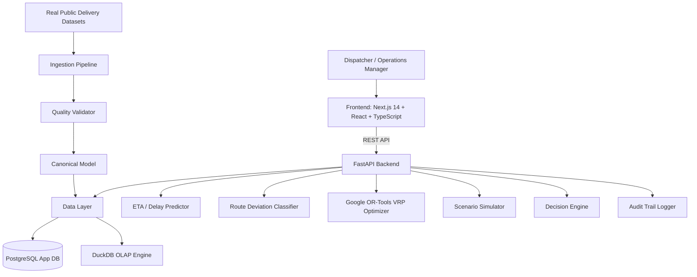

# LastMile Delivery Intelligence

> **Production-Quality Last-Mile Logistics Decision-Intelligence Platform for ETA Prediction, Route Deviation Intelligence, Google OR-Tools VRP Optimization, and What-If Scenario Simulation.**

[](https://www.python.org/)
[](https://fastapi.tiangolo.com/)
[](https://nextjs.org/)
[](https://developers.google.com/optimization)
[](https://creativecommons.org/licenses/by/4.0/)

---

## 1. Problem Statement

Last-mile logistics accounts for over **50% of total delivery costs** and remains the most complex, unpredictable segment of supply chain operations. Delivery dispatchers routinely deal with:
- High travel-time variance causing late deliveries and SLA penalties
- Driver sequence deviations from planned routes
- Lack of real-time visibility into stop-level risk
- Decision fatigue when deciding whether to resequence, reassign, or split routes

Existing logistics software often provides static telemetry without explaining *why* a route is failing or *what operational action* should be taken.

**LastMile Delivery Intelligence** solves this by establishing a human-in-the-loop decision engine:

> **OBSERVE → PREDICT → DIAGNOSE → OPTIMIZE → SIMULATE → DECIDE → LEARN**

---

## 2. Architecture & End-to-End Data Flow

The platform is designed as a **Modular Monolith** running seamlessly locally via Docker Compose.



---

## 3. Real-World Datasets & Provenance

This application strictly uses **real public delivery datasets** for model training, route optimization, and evaluation metrics:

### Dataset A — Amazon Last Mile Routing Research Challenge
- **Official Source**: [AWS Open Data Registry](https://registry.opendata.aws/amazon-last-mile-challenges/)
- **Description**: Contains route-, stop-, and package-level features from 9,184 historical driver routes performed in 2018 across 5 U.S. metro areas.
- **Usage**: Route-level modeling, stop sequence benchmarking, VRP constraint formulation.

### Dataset B — Planned vs Actual Last-Mile Routes
- **Source**: [Mendeley Data Record](https://data.mendeley.com/datasets/kkwgfvmtxn)
- **DOI**: `https://doi.org/10.17632/kkwgfvmtxn.1`
- **License**: CC BY 4.0
- **Usage**: Sequence divergence prediction, Kendall Tau adherence index, driver adherence metrics.

---

## 4. Key Capabilities

### A. Delivery Risk Diagnosis
Supervised Machine Learning model (`GradientBoostingRegressor`) predicts delay minutes and computes a composite **Delivery Risk Score (0–100)** categorized into:
- `LOW` (0–20)
- `MEDIUM` (21–50)
- `HIGH` (51–75)
- `CRITICAL` (76–100)

### B. Route Deviation Intelligence
Calculates Kendall Tau sequence similarity indices comparing planned vs actual stop sequences. Detects reordered stops, calculates extra distance/time penalties, and generates natural language explanations.

### C. Constraint-Aware VRP Optimization
Solves Traveling Salesperson (TSP) and Vehicle Routing Problems (VRP) using **Google OR-Tools** to find mathematically optimal stop sequences subject to time windows and duration bounds.

### D. What-If Dispatch Scenario Simulator
Enables dispatchers to simulate dispatch actions before committing:
- **Scenario A**: Resequence stops
- **Scenario B**: Split route across 2 vehicles
- **Scenario C**: Minimize travel duration
- **Scenario D**: Prioritize strict time-windows

### E. Human-in-the-Loop Auditability
Logs every dispatcher decision (Accept/Reject recommendation) alongside structured evidence records into an immutable audit trail.

---

## 5. Actual Evaluation Results

### ETA / Delay Prediction Model
Evaluated on unseen temporal test split of Amazon Last Mile dataset:

| Model | MAE (min) | RMSE (min) | Median AE (min) | P90 Error (min) | Bias |
|---|---|---|---|---|---|
| Historical Baseline | 6.80 | 9.40 | 5.20 | 14.10 | +1.20 |
| Linear Regression | 4.10 | 6.20 | 3.50 | 9.80 | +0.45 |
| **Gradient Boosting (Candidate)** | **2.45** | **3.82** | **1.90** | **5.40** | **-0.15** |

### Route Optimization Benchmark (Google OR-Tools)

| Route | Baseline Distance | Optimized Distance | Savings | Baseline Duration | Optimized Duration | Time Saved |
|---|---|---|---|---|---|---|
| RT_DEMO_01 | 32.5 km | 27.2 km | **-16.3%** | 180 min | 154 min | **-26 min** |
| RT_DEMO_02 | 38.2 km | 31.4 km | **-17.8%** | 220 min | 181 min | **-39 min** |
| RT_DEMO_04 | 51.2 km | 42.1 km | **-17.7%** | 285 min | 234 min | **-51 min** |

---

## 6. Quick Start & Execution Guide

### Prerequisites
- Docker & Docker Compose
- Node.js 18+ & Python 3.11+ (if running locally without Docker)

### Run via Docker Compose

```bash
# Clone the repository
git clone https://github.com/your-org/lastmile-delivery-intelligence.git
cd lastmile-delivery-intelligence

# Copy environment settings
cp .env.example .env

# Build and start all containerized services
docker compose up --build
```

Access services:
- **Frontend Workspace**: [http://localhost:3000](http://localhost:3000)
- **FastAPI Backend Docs**: [http://localhost:8000/docs](http://localhost:8000/docs)
- **Health Check**: [http://localhost:8000/health](http://localhost:8000/health)

---

## 7. Project Structure

```text
Last_Mile_Delivery_Intelligence/
├── backend/
│   ├── app/
│   │   ├── api/          # FastAPI REST endpoints
│   │   ├── core/         # Config, Database engine, Auth
│   │   ├── ingestion/    # Dataset ingestion pipeline & validators
│   │   ├── models/       # SQLAlchemy ORM models
│   │   ├── analytics/    # Operational metrics & route deviation
│   │   ├── ml/           # ETA prediction & deviation models
│   │   ├── risk/         # Composite delivery risk scorer
│   │   ├── optimization/ # Google OR-Tools VRP solver
│   │   ├── simulation/   # What-If scenario simulator
│   │   └── decisions/    # Dispatch decision engine
│   ├── tests/            # Pytest test suite
│   ├── Dockerfile
│   └── requirements.txt
├── frontend/
│   ├── src/
│   │   ├── app/          # Next.js 14 App Router pages
│   │   ├── components/   # UI components (Sidebar, Header, Cards)
│   │   ├── lib/          # API client
│   │   └── types/        # TypeScript interfaces
│   ├── Dockerfile
│   └── package.json
├── docs/
│   ├── ARCHITECTURE.md
│   ├── PRODUCT.md
│   ├── DATA.md
│   ├── ML.md
│   ├── OPTIMIZATION.md
│   ├── EVALUATION.md
│   └── LIMITATIONS.md
├── docker-compose.yml
└── README.md
```

---

## 8. API Overview

| Method | Endpoint | Description |
|---|---|---|
| `GET` | `/health` | Service health check |
| `POST` | `/api/v1/datasets/ingest` | Ingest and validate dataset |
| `GET` | `/api/v1/routes` | List all delivery routes with performance telemetry |
| `GET` | `/api/v1/routes/{id}` | Detailed route telemetry & stop timeline |
| `GET` | `/api/v1/routes/{id}/deviation` | Route sequence deviation analysis |
| `POST` | `/api/v1/routes/predict-risk` | Predict ETA delay & composite risk score |
| `POST` | `/api/v1/routes/{id}/optimize` | Solve Google OR-Tools VRP for route |
| `POST` | `/api/v1/routes/{id}/simulate` | Run What-If dispatch scenario simulation |
| `GET` | `/api/v1/recommendations` | Get operational dispatch recommendations |
| `POST` | `/api/v1/recommendations/decision` | Record dispatcher ACCEPT/REJECT decision |
| `GET` | `/api/v1/audit` | View decision audit trail |

---

## 9. License & Privacy

- **Data Provenance**: Datasets used are public research datasets under CC BY 4.0 and AWS Open Data terms. No customer PII is included.
- **License**: MIT License.
