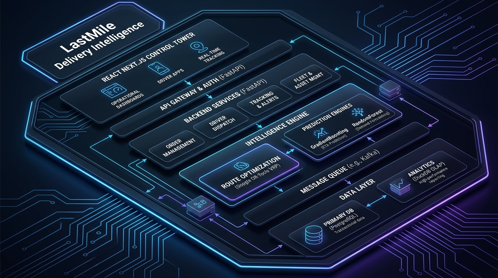
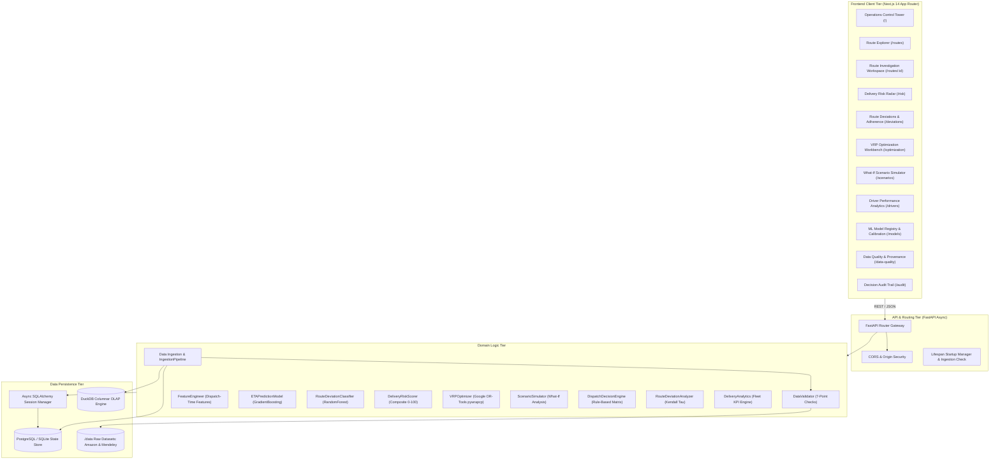
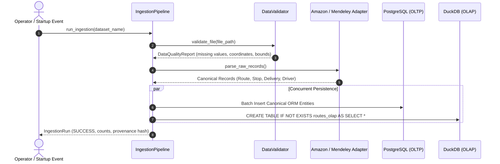
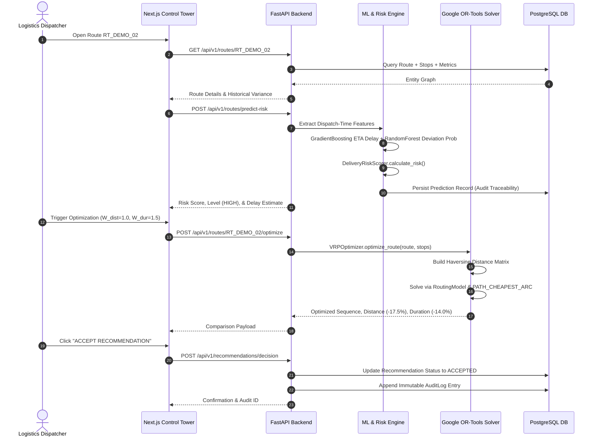
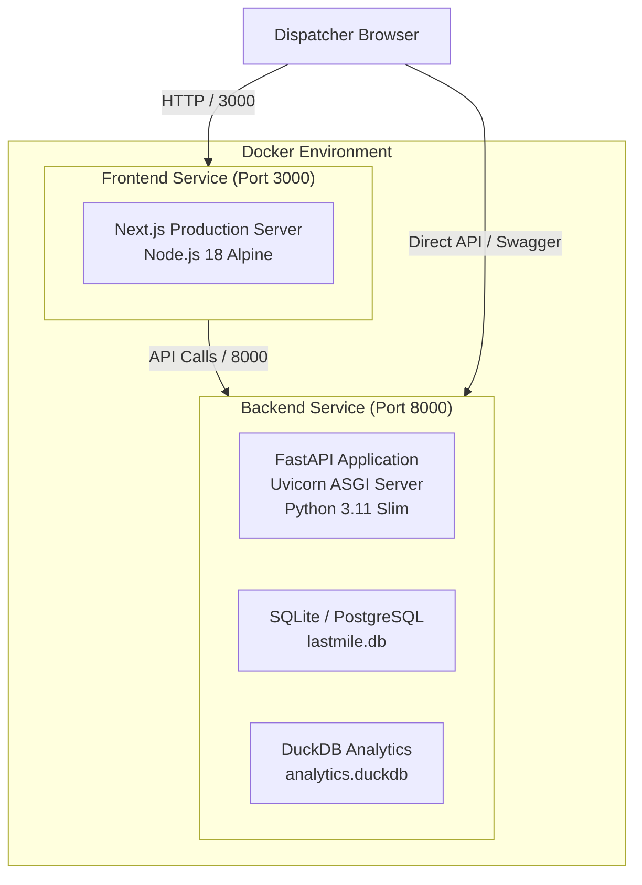

# System Architecture — LastMile Delivery Intelligence

## 1. Architectural Overview

LastMile Delivery Intelligence is architected as an **enterprise modular monolith** designed for high-throughput decision-making, explainable machine learning predictions, and deterministic vehicle routing optimization.

Rather than fragmenting operations across microservices with distributed transaction overhead, the platform integrates data ingestion, feature engineering, mathematical optimization, and operational analytics into a cohesive, high-performance service tier.



---

## 2. Core Architectural Principles

1. **Deterministic Optimization + Statistical Machine Learning**: Machine learning is employed exclusively for uncertain environmental factors (driver delay, likelihood of route deviation), whereas deterministic combinatorial algorithms (Google OR-Tools) solve routing constraints, traveling salesperson sequences, and vehicle assignments.
2. **Dual-Store Data Architecture (OLTP + OLAP)**: Application state, real-time dispatch decisions, and immutable audit logs are persisted in PostgreSQL / SQLite, while analytical fleet aggregations and historical query performance are powered by DuckDB with columnar Parquet storage.
3. **Dispatch-Time Temporal Leakage Prevention**: All predictive ML models are isolated from outcome telemetry. Only features available at route departure time $T_0$ are exposed to inference pipelines.
4. **Human-in-the-Loop Decision Governance**: Algorithmic recommendations generate structured evidence payloads. Final dispatch decisions require human authorization and are preserved in an append-only audit trail.

---

## 3. High-Level System Architecture



---

## 4. Layer Breakdown & Technology Stack

| Layer | Technology | Primary Functionality |
| :--- | :--- | :--- |
| **Frontend UI** | Next.js 14, React 18, TypeScript | High-performance Operations Control Tower, server-side rendering, responsive dark-theme glassmorphism UI. |
| **Styling & Visualization** | Tailwind CSS, Lucide Icons, Recharts | Real-time distance variance bar charts, risk gauges, sequence progression diagrams, interactive metric cards. |
| **API Web Server** | FastAPI, Uvicorn, Starlette | Asynchronous HTTP REST endpoints, automatic OpenAPI / Swagger generation, dependency injection, CORS handling. |
| **Validation & Serialization** | Pydantic V2 | Type-safe schema validation, request payload parsing, response model contract enforcement. |
| **Relational Storage (OLTP)** | SQLAlchemy 2.0 (Async), PostgreSQL / SQLite | Acid-compliant entity storage (`routes`, `stops`, `deliveries`, `drivers`, `recommendations`, `audit_logs`). |
| **Analytical Storage (OLAP)**| DuckDB, Apache Parquet | Fast in-process analytical SQL queries on route historical distributions (`routes_olap`). |
| **Optimization Engine** | Google OR-Tools (`ortools.constraint_solver.pywrapcp`) | Traveling Salesperson Problem (TSP) & Vehicle Routing Problem (VRP) solver with penalty terms and capacity constraints. |
| **Predictive ML** | scikit-learn (`GradientBoostingRegressor`, `RandomForestClassifier`), NumPy, Pandas | Supervised ETA delay regression, binary deviation classification, Kendall Tau sequence rank correlation. |
| **Containerization & Deployment** | Docker, Docker Compose, Render PaaS | Multi-stage container builds for frontend and backend with environment configuration. |

---

## 5. Subsystem Deep-Dives

### 5.1 Backend Modular Services

The backend source structure (`backend/app`) is segregated into discrete operational domains:

```text
backend/app/
├── analytics/         # Analytical computation engines
│   ├── delivery.py    # Fleet-wide KPI calculations (OTD rate, P90/P95 delay)
│   └── deviation.py   # Normalized Kendall Tau distance & stop reorder detection
├── api/               # API route controllers
│   ├── audit.py       # GET /audit (immutable decision logs)
│   ├── datasets.py    # GET /datasets, POST /datasets/ingest, GET /datasets/quality
│   ├── deliveries.py  # GET /deliveries, GET /deliveries/{id}, POST /routes/predict-risk
│   ├── drivers.py     # GET /drivers (route difficulty-adjusted performance)
│   ├── health.py      # GET /health (service & data mode status)
│   ├── models.py      # GET /models, GET /metrics (model registry and evaluation)
│   ├── optimization.py# POST /routes/{id}/optimize, POST /routes/{id}/simulate
│   ├── recommendations.py # GET /recommendations, POST /recommendations/decision
│   └── routes.py      # GET /routes, GET /routes/{id}, GET /routes/{id}/deviation
├── core/              # Infrastructure and configuration
│   ├── config.py      # Environment variables via Pydantic BaseSettings
│   └── database.py    # Async engine, session factories, init_db()
├── decisions/         # Human-in-the-loop decision intelligence
│   └── engine.py      # Rule-based decision matrix generating recommendations
├── ingestion/         # Ingestion, validation, and normalization
│   ├── amazon_adapter.py    # Amazon Last Mile Challenge JSON parser
│   ├── mendeley_adapter.py  # Mendeley Planned vs Actual CSV parser
│   ├── canonical.py         # Canonical schema mapping
│   ├── pipeline.py          # Dual-write pipeline (PostgreSQL + DuckDB)
│   └── validation.py        # 7-stage quality validator & SHA-256 provenance
├── ml/                # Predictive machine learning
│   ├── deviation_model.py   # RandomForestClassifier for route deviation
│   ├── eta_model.py         # GradientBoostingRegressor for ETA delay
│   └── features.py          # Strict dispatch-time 9-feature extractor
├── models/            # SQLAlchemy database entities
│   └── models.py      # 14 relational tables mapping the logistics domain
├── optimization/      # Constraint programming
│   └── vrp.py         # OR-Tools VRP and TSP solver
├── risk/              # Risk evaluation
│   └── scorer.py      # Composite multi-factor 0-100 risk scoring
├── schemas/           # Pydantic V2 contract schemas
│   └── schemas.py     # Request/response schemas
└── simulation/        # Operational scenario testing
    └── simulator.py   # What-If dispatcher simulator
```

---

### 5.2 Data Ingestion & Dual-Store Architecture

The platform separates fast transactional writes from analytical batch queries:



1. **Transactional Store (PostgreSQL / SQLite)**:
   - Stores granular relationships (`Route` $\rightarrow$ `Stop` $\rightarrow$ `Delivery`).
   - Maintains transactional integrity for dispatcher actions (`Recommendation` $\rightarrow$ `AuditLog`).
   - Uses SQLAlchemy `selectinload` to prevent N+1 query overhead.
2. **Analytical Store (DuckDB)**:
   - Houses the `routes_olap` table backed by columnar storage.
   - Computes quantile aggregations (P90 and P95 delivery delay distributions) in milliseconds without placing load on the primary transactional database.

---

### 5.3 Request Lifecycle: Route Investigation & Optimization

When a dispatcher navigates to the Route Investigation Workspace (`/routes/[id]`):



---

## 6. Containerization & Deployment Architecture

The system is deployed using isolated Docker containers orchestrated via `docker-compose.yml`:



### Docker Multi-Stage Strategy
- **Frontend Dockerfile**: Multi-stage build leveraging Node.js 18 Alpine. Installs dependencies with `npm ci`, compiles Next.js standalone output, and runs in a lightweight runtime container.
- **Backend Dockerfile**: Python 3.11-slim base image. Installs C build dependencies required for `numpy`, `scikit-learn`, and `ortools`, followed by dependency installation and non-root execution.
- **Render Deployment (`render.yaml`)**: Preconfigured for Render PaaS deployment with automatic environment variable injection and persistent disk mounts for SQLite and DuckDB files.

---

## 7. Security, Concurrency & Reliability

1. **CORS Security**:
   - Explicitly configured via `CORSMiddleware`.
   - In production, allowed origins are restricted via `ALLOWED_ORIGINS` environment variable.
   - `allow_credentials` is set to `False` to prevent wildcard origin credential leaks.
2. **Database Concurrency**:
   - Asynchronous SQLAlchemy (`async_engine` + `AsyncSessionLocal`) guarantees non-blocking I/O.
   - Relationships utilize `lazy="raise"` on sensitive foreign keys (e.g. `driver`) to prevent implicit synchronous blocking queries.
3. **Graceful Startup Handling**:
   - `lifespan` context manager handles initial schema migrations with `init_db()`.
   - Validates existence of default benchmark records to prevent redundant re-ingestion loops.
   - Warns operators if the default development `SECRET_KEY` is active.
