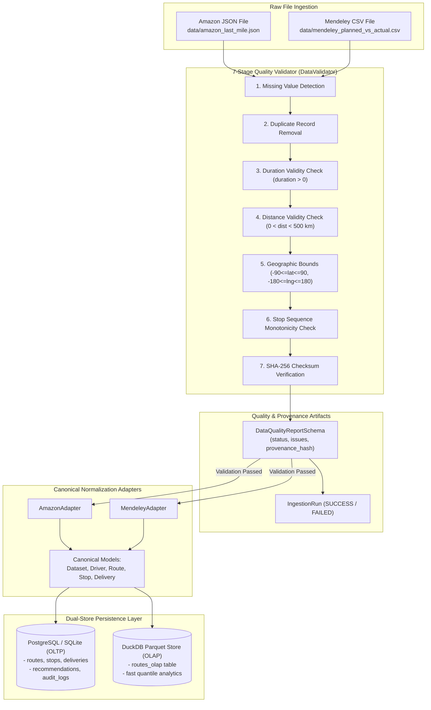
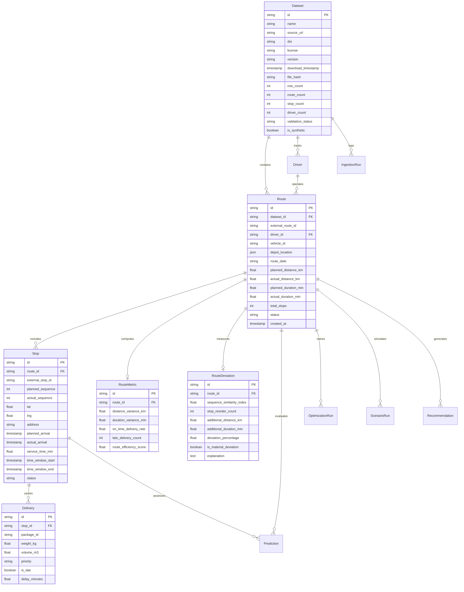

# Data Engineering, Provenance & Validation — LastMile Delivery Intelligence

## 1. Data Engineering Philosophy

LastMile Delivery Intelligence is engineered around **real-world logistics research datasets**. The data engineering pipeline is constructed to guarantee:

1. **Strict Provenance Tracking**: Every ingested dataset record maintains immutable metadata: source URL, DOI, licensing, download timestamp, and cryptographic SHA-256 file hashes.
2. **Canonical Data Normalization**: Raw heterogeneous formats (nested JSON from Amazon, multi-column CSV from Mendeley) are normalized into a unified relational schema (`Route`, `Stop`, `Delivery`, `Driver`).
3. **Data Quality Enforcements**: Automated 7-stage quality validator checks for spatial, temporal, and sequence anomalies before data enters the production database.
4. **Dual-Store Architecture (OLTP + OLAP)**: High-write relational records are stored in PostgreSQL/SQLite for transactional operations, while analytical route distributions are indexed in DuckDB using columnar Parquet.
5. **Absolute Data Honesty Policy**: Synthetic data fixtures are clearly tagged (`is_synthetic = True`, `data_mode = "synthetic_demo"`) and never used for reported model evaluation metrics.

---

## 2. Primary Public Datasets

### 2.1 Amazon Last Mile Routing Research Challenge
- **Source**: [AWS Open Data Registry](https://registry.opendata.aws/amazon-last-mile-challenges/)
- **Publication Year**: 2021
- **Domain**: Real-world e-commerce van delivery operations conducted across 5 metropolitan areas in the United States (Seattle, Chicago, Los Angeles, Austin, Boston).
- **Scope**: 9,184 historical delivery routes, over 1.2 million individual package deliveries.
- **Attributes Utilized**:
  - `route_id`, `station_code` (depot), `date_YYYY_MM_DD`, `departure_time`
  - `stops`: Stop IDs, latitude/longitude coordinates, stop type (`Dropoff`, `Station`), service time estimates.
  - `packages`: Dimensions ($L \times W \times H$), package weight (kg), volume ($m^3$), delivery time windows.
- **Role in Platform**: Primary benchmark for vehicle routing problem (VRP) optimization, spatial feature engineering, and stop-level service time analysis.
- **Setup Instruction**: Download `amazon_last_mile.json` from the official AWS Open Data Registry and place it in `./data/amazon_last_mile.json`.

### 2.2 Planned vs Actual Last-Mile Delivery Routes (Mendeley Data)
- **Source**: [Mendeley Data Repository](https://data.mendeley.com/datasets/kkwgfvmtxn)
- **DOI**: [`10.17632/kkwgfvmtxn.1`](https://doi.org/10.17632/kkwgfvmtxn.1)
- **License**: Creative Commons Attribution 4.0 International (CC BY 4.0)
- **Domain**: European urban courier and express parcel distribution network.
- **Scope**: Multi-stop commercial courier delivery routes with GPS telemetry.
- **Attributes Utilized**:
  - Planned route stop sequences vs actual executed driver stop sequences.
  - Planned travel distance (km) vs actual driven distance (km).
  - Planned route duration (min) vs actual route completion duration (min).
  - Stop arrival timestamps and delivery time-window compliance indicators.
- **Role in Platform**: Ground-truth benchmark for route deviation detection, Kendall Tau sequence rank similarity, and driver route adherence profiling.
- **Setup Instruction**: Download `mendeley_planned_vs_actual.csv` from Mendeley Data and place it in `./data/mendeley_planned_vs_actual.csv`.

### 2.3 Optional Third Dataset — LaDe (Last-mile Delivery Dataset)
- **Source**: Industry-scale benchmark from Cainiao / Alibaba Network.
- **Attributes**: Fine-grained courier trajectories with GPS point sequences.
- **Role in Platform**: Serves as a reference design for micro-telemetry expansion in Phase 4 roadmap.

---

## 3. Data Pipeline & Processing Flow

---

## 4. Canonical Delivery Data Model (Entity Relationship)

All incoming datasets are mapped into a standardized relational data model:

---

## 5. Automated Data Quality Enforcements

The `DataValidator` module implements 7 validation rules:

| # | Check Name | Validation Logic | Failure Classification |
| :--- | :--- | :--- | :--- |
| **1** | **Missing Values** | Checks critical keys (`route_id`, `stop_id`, coordinates). | Critical if primary identifiers null; Warning if metadata missing. |
| **2** | **Duplicate Detection**| Scans for duplicate stop identifiers within the same route. | Critical if duplicate stop sequences detected. |
| **3** | **Duration Bounds** | Verifies planned and actual duration are $> 0$ and $< 1,440\text{ min}$ (24h). | Critical if negative; Warning if duration $> 12\text{ hours}$. |
| **4** | **Distance Bounds** | Confirms route distances are $> 0.1\text{ km}$ and $< 600.0\text{ km}$. | Warning if distance exceeds single-shift bounds. |
| **5** | **Coordinate Bounds**| Validates $-90.0 \le \text{lat} \le 90.0$ and $-180.0 \le \text{lng} \le 180.0$. | Critical if out of physical bounds. |
| **6** | **Sequence Integrity**| Validates planned sequence starts at $1$ and increments monotonically. | Warning if non-consecutive stop sequences exist. |
| **7** | **Provenance Checksum**| Computes cryptographic SHA-256 hash of the input file. | Preserved permanently in `datasets.file_hash`. |

---

## 6. Synthetic Data Policy & Fallback Discipline

To support frictionless out-of-the-box local development, testing, and UI demonstrations without requiring users to download gigabytes of raw data:

1. **Explicit Tagging**: If neither Amazon nor Mendeley dataset files are located in `./data/`, the application bootstraps a lightweight benchmark fixture.
2. **Database Level**: The corresponding `Dataset` record is marked with `is_synthetic = True`.
3. **API Level**: Endpoints return `data_mode: "synthetic_demo"`.
4. **Machine Learning Integrity**: The ML subsystem reports:
   - `evaluation_status: "insufficient_data"`
   - `metrics: null`
5. **No Fake Claims**: The system **never** trains production models on synthetic fixtures or reports synthetic test metrics as genuine model performance.

---

## 7. Known Data Limitations

- **Urban Street Network vs Straight-Line Coordinates**: Datasets provide latitude/longitude waypoints rather than full GPS turn-by-turn vectors. Distance computations use the Haversine great-circle formula.
- **Static vs Dynamic Traffic**: Real historical datasets reflect observed transit times but do not include high-frequency live traffic sensor feeds.
- **Service Time Imputation**: When raw records omit stop unloading durations, a conservative domain-standard default ($5.0\text{ minutes}$) is applied.
