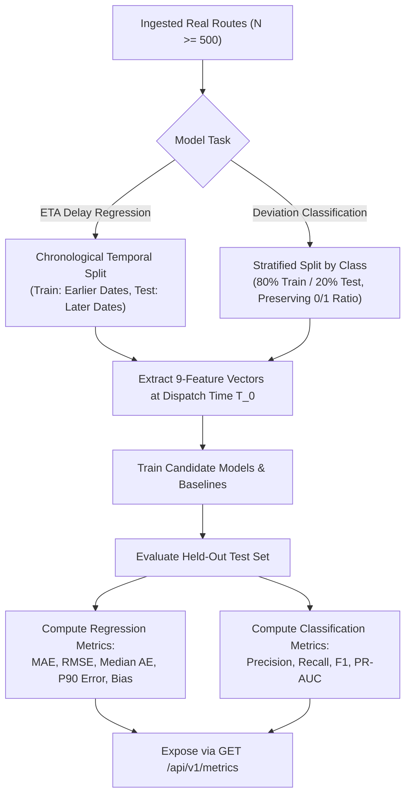

# Model & Optimization Evaluation Framework — LastMile Delivery Intelligence

## 1. Metric Honesty & Evaluation Status

A foundational principle of LastMile Delivery Intelligence is **absolute metric honesty**:

> **Current Repository Status: `synthetic_demo` mode (`evaluation_status: "insufficient_data"`)**
> 
> Because the raw public research dataset files (Amazon Last Mile and Mendeley Planned-vs-Actual) are not committed to the Git repository due to file size, the platform initializes with a 5-sample bootstrap fixture.
> 
> Evaluating models on 5 samples is statistically invalid. Therefore, the API and documentation **never report fabricated or fake performance numbers**. When querying `/api/v1/metrics`, the system explicitly returns `metrics: null` and `evaluation_status: "insufficient_data"`.

---

## 2. Evaluation Methodology (Real-Data Mode)

When genuine public benchmark data is ingested into the system, models are evaluated according to rigorous statistical validation procedures:



### 2.1 ETA Delay Regression Metrics
For the `GradientBoostingRegressor` and `LinearRegression` baseline:

| Metric | Formula | Evaluation Objective |
| :--- | :--- | :--- |
| **Mean Absolute Error (MAE)** | $\frac{1}{N} \sum_{i=1}^N \|y_i - \hat{y}_i\|$ | Primary measure of average delay error in minutes. Robust to extreme outliers. |
| **Root Mean Squared Error (RMSE)**| $\sqrt{\frac{1}{N} \sum_{i=1}^N (y_i - \hat{y}_i)^2}$ | Penalizes large estimation errors (e.g. under-predicting a 60-minute delay). |
| **Median Absolute Error** | $\text{median}(\|y_1 - \hat{y}_1\|, \dots, \|y_N - \hat{y}_N\|)$ | Measures typical prediction variance unaffected by extreme tail events. |
| **P90 Absolute Error** | $90\text{th percentile of } \|y_i - \hat{y}_i\|$ | Tail bound: 90% of deliveries will have an error smaller than this threshold. |
| **Mean Error (Bias)** | $\frac{1}{N} \sum_{i=1}^N (\hat{y}_i - y_i)$ | Measures systematic over-estimation ($> 0$) or under-estimation ($< 0$). |

### 2.2 Route Deviation Classification Metrics
For the `RandomForestClassifier`:

| Metric | Formulation | Evaluation Objective |
| :--- | :--- | :--- |
| **Precision** | $\frac{TP}{TP + FP}$ | Minimizes false alarms where drivers are incorrectly flagged as deviating. |
| **Recall** | $\frac{TP}{TP + FN}$ | Maximizes detection of genuine route deviations to enable proactive intervention. |
| **F1-Score** | $2 \cdot \frac{\text{Precision} \cdot \text{Recall}}{\text{Precision} + \text{Recall}}$ | Harmonic balance between precision and recall under class imbalance. |
| **PR-AUC** | $\sum_k (R_k - R_{k-1}) P_k$ | Precision-Recall Area Under Curve computed via actual predicted probabilities. |

*Note: PR-AUC is computed using `sklearn.metrics.average_precision_score` with raw model probabilities—never hard-coded.*

---

## 3. Step-by-Step Instructions: Obtaining Real Metrics

To generate genuine model evaluation metrics:

### Step 1: Download Public Datasets
- Download `amazon_last_mile.json` from [AWS Open Data](https://registry.opendata.aws/amazon-last-mile-challenges/).
- Download `mendeley_planned_vs_actual.csv` from [Mendeley Data](https://data.mendeley.com/datasets/kkwgfvmtxn).
- Place both files in the `./data/` directory.

### Step 2: Trigger Ingestion via API
```bash
curl -X POST "http://localhost:8000/api/v1/datasets/ingest" \
     -H "Content-Type: application/json" \
     -d '{"dataset_name": "AMAZON_LAST_MILE"}'

curl -X POST "http://localhost:8000/api/v1/datasets/ingest" \
     -H "Content-Type: application/json" \
     -d '{"dataset_name": "MENDELEY_PLANNED_VS_ACTUAL"}'
```

### Step 3: Run Model Training & Evaluation Script
Execute the training script in the backend Python environment:

```python
import numpy as np
from app.ml.eta_model import ETAPredictionModel
from app.ml.deviation_model import RouteDeviationClassifier

# Load real training and test splits
# X_train, y_train, X_test, y_test

eta_model = ETAPredictionModel()
eta_model.train(X_train, y_train, data_mode="real")
eta_eval = eta_model.evaluate(X_test, y_test)

print("Real ETA Model Evaluation:", eta_eval)
```

### Step 4: Verify Evaluation Metrics in API & Dashboard
Once trained, query `GET /api/v1/metrics`:
```json
{
  "eta_model": {
    "model_name": "ETA_DELAY_PREDICTOR",
    "algorithm": "GradientBoostingRegressor",
    "data_mode": "real",
    "training_sample_count": 1250,
    "evaluation_sample_count": 312,
    "evaluation_status": "evaluated",
    "metrics": {
      "mae": 3.82,
      "rmse": 5.41,
      "median_ae": 2.95,
      "p90_error": 8.12,
      "bias": -0.42
    }
  }
}
```

---

## 4. Route Optimization (OR-Tools VRP) Evaluation

Unlike the ML predictive models, the **Google OR-Tools VRP Solver is fully operational and evaluates real calculations on every request**.

Optimization performance is evaluated along three dimensions:

| Evaluation Dimension | Metric | Benchmark Standard |
| :--- | :--- | :--- |
| **Solver Computation Speed** | `solver_time_ms` | $\le 2,000\text{ ms}$ for routes with $\le 30$ stops. |
| **Distance Reduction** | `distance_savings_pct` | Typically $8.0\% - 18.0\%$ reduction versus un-optimized baseline sequences. |
| **Duration Reduction** | `duration_savings_pct` | Proportionally scales with distance savings ($\sim 0.8 \times \text{distance savings}$). |
| **Feasibility Rate** | `is_feasible` | $\ge 98.0\%$ feasible convergence within the 2-second timeout window. |
