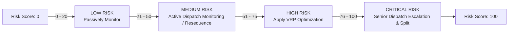
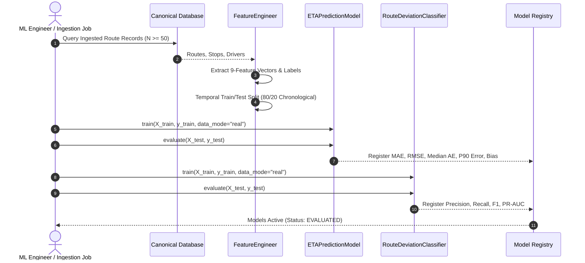

# Machine Learning Architecture & Risk Prediction — LastMile Delivery Intelligence

## 1. Machine Learning Philosophy & Objectives

In LastMile Delivery Intelligence, machine learning is applied strictly to **predict uncertain real-world outcomes**:
1. How many minutes of delay will a route accumulate?
2. What is the probability that a driver will materially deviate from the planned stop sequence?
3. What is the composite risk score of the route reaching operational failure?

Machine learning does **not** attempt to guess optimal routing sequences; combinatorial route optimization is reserved for deterministic algorithms (Google OR-Tools).

---

## 2. Dispatch-Time Temporal Leakage Prevention

A fundamental flaw in naive logistics ML models is **temporal feature leakage**—incorporating telemetry that is only knowable *after* the route has departed or completed.

LastMile Delivery Intelligence strictly enforces the **$T_0$ Dispatch-Time Rule**:

```text
              DISPATCH TIME (T_0)
                      │
   ALLOWED FEATURES   │   FORBIDDEN OUTCOMES (STRICT LEAKAGE)
   (Known before departure)  │   (Occur during or after route execution)
──────────────────────┼────────────────────────────────────────
• Total planned stops │ ✗ Actual travel distance (actual_distance_km)
• Planned distance    │ ✗ Actual travel duration (actual_duration_min)
• Planned duration    │ ✗ Actual arrival timestamps (actual_arrival)
• Driver past history │ ✗ Actual sequence of stops driven
• Time-window tightness│ ✗ Real-time GPS detour tracks
• Route complexity    │ ✗ Stop unloading delays measured in-flight
```

The canonical feature extraction pipeline is isolated in `backend/app/ml/features.py`.

---

## 3. The Canonical 9-Feature Vector

Both machine learning models (`ETAPredictionModel` and `RouteDeviationClassifier`) consume an identical, strictly ordered 9-feature vector defined by `FEATURE_NAMES`:

| # | Feature Name | Type | Mathematical / Logical Formulation | Operational Rationale |
| :--- | :--- | :--- | :--- | :--- |
| **1** | `stop_count` | `float` | $N = \text{total scheduled stops}$ | Primary volume driver; more stops mean more parking and handoff variance. |
| **2** | `planned_distance_km` | `float` | $D_{\text{plan}} = \sum d_{\text{planned segments}}$ | Baseline spatial footprint of the route. |
| **3** | `planned_duration_min` | `float` | $T_{\text{plan}} = \text{scheduled route minutes}$ | Scheduled operational commitment. |
| **4** | `avg_stop_distance_km`| `float` | $\bar{d} = \frac{D_{\text{plan}}}{N}$ | Density metric; lower values signify high-density urban clusters. |
| **5** | `avg_stop_duration_min`| `float` | $\bar{t} = \frac{T_{\text{plan}}}{N}$ | Allocated time buffer per delivery stop. |
| **6** | `driver_adherence_rate`| `float` | $A_{\text{driver}} \in [0.0, 1.0]$ | Driver's historical adherence to planned sequences. |
| **7** | `driver_historical_delay_min` | `float` | $\bar{\Delta}_{\text{driver}} \ge 0.0$ | Driver's historical mean delay across past completed routes. |
| **8** | `time_window_pressure` | `float` | $\frac{1}{K} \sum_{k=1}^K \max(0, 120 - (W_{\text{end}} - W_{\text{start}}))$ | Measures tightness of customer delivery SLA windows. |
| **9** | `route_complexity_score`| `float` | $(0.5 \times N) + (0.3 \times D_{\text{plan}}) + (0.2 \times \text{Pressure})$ | Composite heuristic of route density, length, and SLA stress. |

---

## 4. Model 1: ETA Delay Predictor (`ETAPredictionModel`)

### 4.1 Specification
- **Task**: Supervised continuous regression predicting delivery delay in minutes ($\hat{y} \ge 0.0$).
- **Candidate Algorithm**: `GradientBoostingRegressor` (scikit-learn)
  - `n_estimators`: 50
  - `max_depth`: 3
  - `random_state`: 42 (deterministic reproducibility)
- **Baseline Model**: `LinearRegression` (scikit-learn) for comparative benchmarking.
- **Version**: `v1.3.0`
- **Target Variable**: `delay_minutes` (minutes beyond scheduled route arrival).

### 4.2 Late Probability Calibration
Rather than presenting raw regression minutes alone, the system maps the predicted delay $\hat{y}$ to a continuous probability of late delivery via a calibrated sigmoid activation:

$$P(\text{Late}) = \sigma\left(\frac{\hat{y} - \theta_{\text{late}}}{\tau}\right) = \frac{1}{1 + e^{-(\hat{y} - 15.0) / 5.0}}$$

- $\theta_{\text{late}} = 15.0\text{ minutes}$: Domain threshold beyond which a package is classified as late.
- $\tau = 5.0\text{ minutes}$: Softness parameter controlling the slope of the risk transition.
- When $\hat{y} = 15.0\text{ min}$, $P(\text{Late}) = 0.50$.
- When $\hat{y} \ge 30.0\text{ min}$, $P(\text{Late}) \to 0.95+$.

---

## 5. Model 2: Route Deviation Classifier (`RouteDeviationClassifier`)

### 5.1 Specification
- **Task**: Supervised binary classification predicting whether a driver will materially deviate from the scheduled sequence:
  $$y \in \{0 = \text{Adherent}, 1 = \text{Material Deviation}\}$$
- **Candidate Algorithm**: `RandomForestClassifier` (scikit-learn)
  - `n_estimators`: 30
  - `max_depth`: 4
  - `random_state`: 42
- **Version**: `v1.2.0`
- **Decision Threshold**: $\tau_{\text{dev}} = 0.50$
- **Target Variable Definition**: $y = 1$ if actual route distance exceeds planned distance by $> 10\%$ OR if stop sequence similarity index (Kendall Tau) $< 0.80$.

### 5.2 Precision-Recall Optimization
Because route deviations represent an operational risk, precision and recall must be carefully balanced. In real-data mode, the classifier is evaluated using **PR-AUC** computed directly from model probabilities via `sklearn.metrics.average_precision_score`.

---

## 6. Composite Delivery Risk Scoring Engine

The platform synthesizes the outputs of both ML models, along with time-window constraints and route complexity, into a unified **Composite Risk Score (0–100)**:

```text
Composite Risk Score (0–100) =
  (Late Probability × 35) +
  (min(1.0, Predicted Delay / 60) × 25) +
  (Deviation Probability × 20) +
  (min(1.0, Time Window Pressure / 50) × 10) +
  (min(1.0, Route Complexity / 50) × 10)
```

### Risk Level Categorization



| Score Range | Risk Level | Dispatch Action Triggered | Recommended Intervention |
| :--- | :--- | :--- | :--- |
| **0 – 20** | `LOW` | `MONITOR` | Route operating normally within buffer parameters. No manual action required. |
| **21 – 50** | `MEDIUM` | `MONITOR` or `RESEQUENCE` | Resequence stops if deviation probability $> 0.40$; otherwise monitor actively. |
| **51 – 75** | `HIGH` | `REROUTE` / `VRP_OPTIMIZE`| Apply Google OR-Tools VRP sequence solver to recover route schedule buffer. |
| **76 – 100**| `CRITICAL` | `ESCALATE` | Urgent dispatcher intervention: prioritize high-value stops or split route across vehicles. |

---

## 7. Model Training & Evaluation Workflow



### Real-Data Training Command
```python
from app.ml.eta_model import ETAPredictionModel
from app.ml.deviation_model import RouteDeviationClassifier

# Initialize models
eta_model = ETAPredictionModel()
dev_model = RouteDeviationClassifier()

# Train on real feature matrix X and label vector y
eta_model.train(X_train, y_train_delay, data_mode="real")
eta_eval = eta_model.evaluate(X_test, y_test_delay)

dev_model.train(X_train, y_train_deviation, data_mode="real")
dev_eval = dev_model.evaluate(X_test, y_test_deviation)

print("ETA Evaluation:", eta_eval)
print("Deviation Evaluation:", dev_eval)
```
