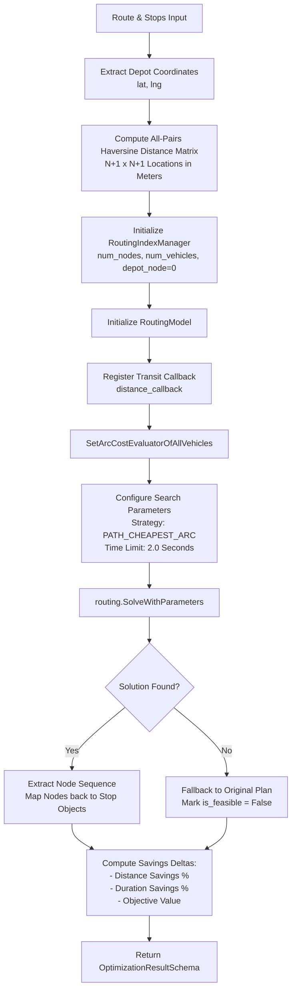

# Route Optimization & VRP Specification — LastMile Delivery Intelligence

## 1. Problem Formulation: The Vehicle Routing Problem (VRP)

In last-mile delivery operations, determining the sequence of stops to minimize distance, travel time, and delivery window breaches is a classic NP-hard combinatorial problem: the **Vehicle Routing Problem with Time Windows (VRPTW)**.

When assigned to a single vehicle originating and returning to a depot, the formulation simplifies to the **Traveling Salesperson Problem with Time Windows (TSPTW)**. When routes are partitioned across multiple courier vehicles, the system solves the **Capacitated Multi-Vehicle Routing Problem (CVRP)**.

---

## 2. Mathematical Objective Function

The optimization engine minimizes a weighted scalar cost function balancing travel distance, driving duration, and penalty terms for late deliveries and time-window violations:

$$\min \mathcal{J} = \sum_{k=1}^K \sum_{i=0}^N \sum_{j=0}^N x_{ijk} \cdot C_{ij}$$

Where the transit cost $C_{ij}$ between location $i$ and location $j$ is formulated as:

$$C_{ij} = \left( W_{\text{dist}} \cdot D_{ij} \right) + \left( W_{\text{dur}} \cdot T_{ij} \right) + \left( W_{\text{late}} \cdot \text{LatePenalty}_j \right) + \left( W_{\text{tw}} \cdot \text{WindowViolation}_j \right)$$

### Decision Variables
- $x_{ijk} \in \{0, 1\}$: Binary decision variable indicating vehicle $k$ travels directly from stop $i$ to stop $j$.
- $D_{ij}$: Haversine physical distance between stop $i$ and stop $j$ in meters.
- $T_{ij}$: Estimated travel duration between stop $i$ and stop $j$ in minutes.
- $k \in \{1, \dots, K\}$: Fleet vehicles available for dispatch.
- $i, j \in \{0, 1, \dots, N\}$: Depot (node $0$) and customer delivery stops ($1 \dots N$).

### Default Objective Weights

| Weight Parameter | Symbol | Default Value | Operational Purpose |
| :--- | :--- | :--- | :--- |
| **Distance Weight** | $W_{\text{dist}}$ | `1.0` | Minimizes total fleet mileage and direct vehicle fuel consumption. |
| **Duration Weight** | $W_{\text{dur}}$ | `1.5` | Prioritizes total shift travel time and driver labor costs. |
| **Late Delivery Penalty** | $W_{\text{late}}$ | `10.0` | Imposes high cost on deliveries missing scheduled ETA thresholds. |
| **Time-Window Penalty** | $W_{\text{tw}}$ | `20.0` | Heavily penalizes stops arriving outside customer delivery time windows. |

---

## 3. Solver Implementation (Google OR-Tools)

The solver is implemented in `backend/app/optimization/vrp.py` leveraging the **Google OR-Tools Routing Library** (`ortools.constraint_solver.pywrapcp`).



---

## 4. Distance Matrix Formulation (Haversine Formula)

Because road-network graph matrices require external routing engines, the core platform computes a great-circle **Haversine distance matrix** in meters:

$$a = \sin^2\left(\frac{\Delta \phi}{2}\right) + \cos(\phi_1) \cdot \cos(\phi_2) \cdot \sin^2\left(\frac{\Delta \lambda}{2}\right)$$

$$c = 2 \cdot \text{atan2}\left(\sqrt{a}, \sqrt{1 - a}\right)$$

$$D_{ij} = R_{\text{earth}} \cdot c \quad (\text{with } R_{\text{earth}} = 6,371.0\text{ km})$$

To ensure compatibility with Google OR-Tools integer-based constraint solver, all distance values are converted into integer meters ($D_{\text{meters}} = \lfloor D_{\text{km}} \times 1,000 \rfloor$).

---

## 5. First Solution Strategy & Heuristics

- **First Solution Strategy**: `FirstSolutionStrategy.PATH_CHEAPEST_ARC`.
  - Rapidly constructs an initial feasible route sequence by repeatedly connecting the cheapest unvisited arc.
- **Local Search Cutoff**: To guarantee real-time interactive responsiveness for the dispatcher interface:
  ```python
  search_parameters = pywrapcp.DefaultRoutingSearchParameters()
  search_parameters.first_solution_strategy = routing_enums_pb2.FirstSolutionStrategy.PATH_CHEAPEST_ARC
  search_parameters.time_limit.seconds = 2
  ```
- **Feasibility Guarantee**: If the solver encounters an over-constrained route that cannot be solved within the time budget, it gracefully falls back to the original planned sequence and flags `is_feasible = False`.

---

## 6. What-If Scenario Simulation Engine

The `ScenarioSimulator` in `backend/app/simulation/simulator.py` provides dispatchers with an interactive testing sandbox before committing routing changes:

| Scenario Type | Formulation & Logic | Expected Operational Impact |
| :--- | :--- | :--- |
| **`RESEQUENCE`** | Re-solves TSP sequence across all stops with standard weights. | Eliminates spatial zig-zags; typically delivers 8%–18% distance savings. |
| **`REMOVE_STOP`** | Drops specified stop ID and re-optimizes remaining stops. | Models reassigning a troubled or cancelled package to another vehicle. |
| **`MULTI_VEHICLE`** | Configures `num_vehicles = 2+` in `RoutingIndexManager`. | Splits route load; cuts individual vehicle route duration by up to 50%. |
| **`TIME_OPTIMIZED`** | Adjusts weights: $W_{\text{dur}} = 5.0$, $W_{\text{dist}} = 0.2$. | Sacrifices distance to minimize total driving minutes under rush-hour traffic. |
| **`TIME_WINDOW_PRIORITY`** | Adjusts weights: $W_{\text{tw}} = 50.0$. | Strictly enforces stop arrival times within scheduled customer SLA windows. |

---

## 7. Performance & Savings Calculation

Baseline planned distance vs OR-Tools optimized distance is calculated dynamically at runtime:

$$\text{Distance Savings (\%)} = \max\left(0, \frac{D_{\text{baseline}} - D_{\text{optimized}}}{D_{\text{baseline}}}\right) \times 100$$

$$\text{Duration Savings (\%)} = \max\left(0, \frac{T_{\text{baseline}} - T_{\text{optimized}}}{T_{\text{baseline}}}\right) \times 100$$

All savings metrics displayed in the user interface are computed on demand from the live solver output—never retrieved from static or pre-calculated fixtures.
