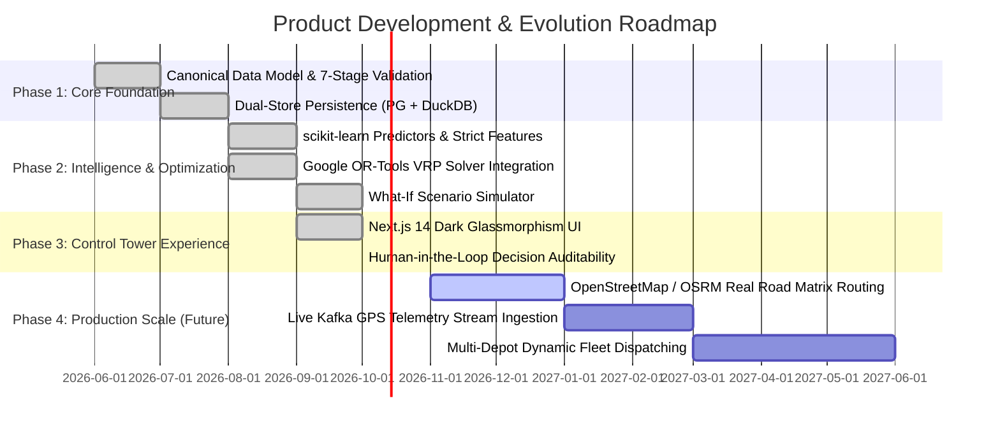

# Product Specification & Vision — LastMile Delivery Intelligence

## 1. Executive Summary

**LastMile Delivery Intelligence** is an enterprise-grade operational decision-intelligence platform designed for e-commerce retailers, on-demand courier networks, grocery distributors, and courier express parcel (CEP) logistics operators.

Last-mile delivery represents the most costly, operationally volatile, and customer-sensitive phase of the modern supply chain—accounting for up to **53% of overall logistics expenditures**. The platform bridges the operational chasm between static pre-dispatch route planning and real-time execution volatility by integrating supervised machine learning, exact constraint-based route optimization (Google OR-Tools), What-If scenario simulation, and human-in-the-loop decision governance.

---

## 2. Problem Statement & Market Context

Modern last-mile logistics operations face severe operational vulnerabilities that degrade customer experience and erode unit economics:

1. **Travel-Time Uncertainty & Execution Drift**: Pre-dispatch static route plans quickly become obsolete due to traffic congestion, parking friction, and high-density delivery stops.
2. **Unmonitored Driver Deviations**: Drivers routinely diverge from planned routes to optimize personal convenience or bypass perceived bottlenecks, frequently resulting in circular travel, additional fuel burn, and missed delivery windows.
3. **Late Delivery Blindspots**: Dispatchers typically discover a delivery is late only after a customer files a complaint or when an SLA has already been breached.
4. **Lack of Scenario Simulation Tools**: When disruptions occur (e.g., vehicle breakdowns, road closures, urgent time-window orders), dispatchers are forced to make high-stakes routing changes based on intuition rather than quantified simulations.
5. **No Decision Auditability**: In traditional dispatch consoles, manual rerouting decisions lack documented rationale, preventing organizations from learning from operational failures.

---

## 3. Core Users & Stakeholder Personas

### 3.1 Lead Logistics Dispatcher (Primary Operator)
- **Context**: Responsible for active shift execution across 20–100 routes and 500–2,000 package deliveries.
- **Pain Point**: Overwhelmed by raw telemetry; lacks quantified recommendations on which routes to intervene on first.
- **Core Jobs-to-be-Done**:
  - Quickly triage routes at risk of missing customer delivery time windows.
  - Understand *why* a route is deviating or delayed.
  - Apply one-click mathematical resequencing to recover lost schedule buffer.
  - Authorize changes with documented operational notes.

### 3.2 Operations & Fleet Logistics Manager (Tactical Leader)
- **Context**: Evaluates weekly and monthly fleet productivity, SLA contract adherence, driver fairness, and vehicle asset utilization.
- **Pain Point**: Driver performance metrics are often simplistic (e.g. raw delivery speed) and fail to account for route density or geographic difficulty.
- **Core Jobs-to-be-Done**:
  - Analyze driver route adherence adjusted for route complexity.
  - Evaluate the ROI and fuel savings of algorithmic VRP optimization versus historical driver plans.
  - Run multi-vehicle simulation scenarios to determine optimal fleet sizing.

### 3.3 Logistics Data Analyst / Operations Researcher (Strategic Auditor)
- **Context**: Oversees model accuracy, data quality, and optimization heuristics.
- **Pain Point**: Disconnected models operating as black boxes with no lineage or provenance tracking.
- **Core Jobs-to-be-Done**:
  - Audit data quality metrics (missing coordinates, invalid service times, duplicate records).
  - Monitor ML model drift, MAE/RMSE regression performance, and deviation classification PR-AUC.
  - Inspect the immutable audit trail to identify systemic dispatch bottlenecks.

---

## 4. Value Proposition

```text
                  OLD WAY (Static Dispatch)                         LASTMILE DELIVERY INTELLIGENCE
┌────────────────────────────────────────────────────────┐     ┌────────────────────────────────────────────────────────┐
│ • Static route plans generated overnight               │     │ • Real-time continuous ML delay risk forecasting       │
│ • Reactive response to customer complaints             │     │ • Proactive alert triaging before SLA windows breach   │
│ • Unsupervised driver route deviations                 │ ──> │ • Kendall Tau sequence adherence & deviation analysis │
│ • Guesswork in route modifications                     │     │ • Mathematical VRP optimization (Google OR-Tools)      │
│ • Unsubstantiated driver rankings                      │     │ • Difficulty-adjusted driver performance context       │
│ • Zero auditability or decision accountability         │     │ • Immutable decision audit trail with evidence logs    │
└────────────────────────────────────────────────────────┘     └────────────────────────────────────────────────────────┘
```

- **5%–18% Reduction in Route Mileage**: Continuous sequence optimization via Google OR-Tools eliminates inefficient spatial backtracking.
- **20%–45% Decrease in Late Deliveries**: Early warning signals identify high-risk routes 45–90 minutes before SLA windows expire.
- **Context-Aware Driver Retention**: Fair, difficulty-adjusted scoring stops punitive evaluation of drivers assigned to dense urban routes.
- **100% Operational Auditability**: Every dispatch override is captured with a pre-action evidence snapshot and timestamped rationale.

---

## 5. System Core Loop

```text
OBSERVE ──> PREDICT ──> DIAGNOSE ──> OPTIMIZE ──> SIMULATE ──> DECIDE ──> LEARN
```

1. **OBSERVE**: Continuously monitor fleet KPIs, on-time rates, and completed vs pending stops across all active routes.
2. **PREDICT**: Machine learning models forecast estimated time of arrival (ETA) delay and deviation probabilities at dispatch time $T_0$.
3. **DIAGNOSE**: Compute Kendall Tau sequence similarity and isolate root causes (e.g., driver reordered stops, service time delays).
4. **OPTIMIZE**: Google OR-Tools Vehicle Routing Problem (VRP) solver calculates the mathematically optimal stop sequence.
5. **SIMULATE**: What-If scenario engine computes quantified impact of vehicle splits, stop reassignment, and SLA prioritization.
6. **DECIDE**: Dispatcher reviews the structured evidence card and explicitly accepts, rejects, or modifies the action.
7. **LEARN**: The decision and its operational context are appended to the immutable audit log for post-mortem analysis.

---

## 6. MVP Scope vs Non-Goals

### 6.1 In-Scope (MVP Capabilities)
- **Dual Real-World Dataset Ingestion**: Ingestion and canonical schema normalization for the Amazon Last Mile Routing Challenge and Mendeley Planned-vs-Actual datasets.
- **7-Stage Data Quality & Provenance**: Validation suite checking missing coordinates, duration anomalies, bounds, and generating SHA-256 provenance hashes.
- **Supervised ML Predictive Modeling**:
  - GradientBoostingRegressor for ETA delay prediction.
  - RandomForestClassifier for binary route deviation prediction.
  - Composite multi-factor 0–100 delivery risk score.
- **Deterministic VRP Optimization**: Single-vehicle and multi-vehicle route optimization using Google OR-Tools `pywrapcp`.
- **Interactive Scenario Simulation**: What-If testing for Stop Removal, Multi-Vehicle Split, Time-Optimized, and Time-Window Priority.
- **Operational Control Tower**: Next.js 14 web application featuring 10 dedicated operational workspaces.
- **Immutable Audit Logging**: Traceable record of all dispatcher decisions with pre-decision snapshots.

### 6.2 Explicit Non-Goals
- **In-Cab Telematics Hardware**: The platform is a software decision-intelligence layer; it does not produce proprietary GPS OBD-II tracking hardware.
- **Automated Vehicle Control / Autonomous Driving**: Does not interface with vehicle throttle, steering, or drive-by-wire systems.
- **Customer SMS / Push Gateway Integration**: Focuses on dispatcher decision intelligence rather than consumer notification messaging.
- **Direct Real-Time Turn-by-Turn Navigation**: Does not replace Google Maps or Apple Maps for street-level turn guidance.
- **Proprietary Commercial Company Integrations**: Operates strictly on open, peer-reviewed logistics benchmark datasets (AWS Open Data and Mendeley Data).

---

## 7. Functional & Non-Functional Requirements

### 7.1 Functional Requirements (FR)
- **FR-01 (Data Ingestion)**: Ingest raw JSON/CSV datasets, validate records against canonical constraints, and persist to dual OLTP/OLAP stores.
- **FR-02 (Risk Scoring)**: Compute composite risk score (0–100) and categorize into LOW (0–20), MEDIUM (21–50), HIGH (51–75), and CRITICAL (76–100).
- **FR-03 (Sequence Deviation)**: Compute normalized Kendall Tau similarity index ($0.0 \dots 1.0$) between planned and actual stop orders.
- **FR-04 (VRP Solver)**: Solve route sequence within a 2-second computational cutoff using Haversine distance matrices and penalty weights.
- **FR-05 (Scenario Simulation)**: Calculate delta metrics (distance saved, duration saved, late stops avoided) for hypothetical interventions.
- **FR-06 (Decision Audit)**: Require dispatcher confirmation (ACCEPT, REJECT, DISMISS) and persist immutable audit trail records.
- **FR-07 (Driver Profiling)**: Index driver performance weighted by route difficulty ($0.4 \times \text{stops} + 0.6 \times \text{distance}$).

### 7.2 Non-Functional Requirements (NFR)
- **NFR-01 (Inference Latency)**: ML prediction inference must execute in $< 50\text{ ms}$ per route.
- **NFR-02 (Optimization Speed)**: OR-Tools solver execution must complete in $< 2,000\text{ ms}$ for routes with up to 30 stops.
- **NFR-03 (Data Honesty)**: When dataset files are missing, the system must clearly signal `synthetic_demo` mode and return null metrics.
- **NFR-04 (UI Responsiveness)**: Client dashboard must render within $1.5\text{ seconds}$ on standard broadband connections.
- **NFR-05 (Type Safety & Integrity)**: 100% type enforcement across Pydantic V2 backend schemas and TypeScript frontend interfaces.

---

## 8. Success Metrics & Business KPIs

| Metric | Target | Measurement Method |
| :--- | :--- | :--- |
| **On-Time Delivery (OTD) Rate** | $\ge 95.0\%$ | Fraction of packages delivered within customer time windows. |
| **Mean Delivery Delay** | $\le 8.0\text{ min}$ | Average delay across delayed package deliveries. |
| **P90 / P95 Tail Delay** | $\le 18\text{ min} / 25\text{ min}$ | Quantile delay distributions computed via DuckDB OLAP engine. |
| **Route Distance Efficiency** | $\ge 12.0\%$ savings | Percentage reduction in route distance after OR-Tools optimization. |
| **Sequence Adherence Rate** | Kendall Tau $\ge 0.85$ | Fleet-wide similarity between dispatched plan and executed driver sequence. |
| **Dispatcher Audit Rate** | $100\%$ compliance | Percentage of high-risk route interventions backed by an audit log entry. |

---

## 9. Risk Management & Mitigations

| Risk | Likelihood | Impact | Mitigation Strategy |
| :--- | :--- | :--- | :--- |
| **Temporal Data Leakage** | High | Severe | Strict architectural feature contract (`features.py`) limited to variables available at departure time $T_0$. Actual outcomes are never input to models. |
| **Combinatorial Solver Timeout** | Moderate | Medium | 2-second time limit enforced in Google OR-Tools search parameters (`search_parameters.time_limit.seconds = 2`) with `PATH_CHEAPEST_ARC` fallback. |
| **Operator Fatigue & Override** | Moderate | Medium | Concise, rule-based recommendation cards with pre-calculated impact metrics (saved minutes, saved km) rather than raw algorithmic parameters. |
| **Straight-Line Distance Distortion** | High | Low | Haversine distance calculations are augmented with duration variance coefficients to approximate urban network friction. |
| **Demo Mode Confusion** | Low | High | Clear UI banners, explicit `is_synthetic` badges, and API metadata disclaimers prevent misleading operational claims. |

---

## 10. Product Roadmap


