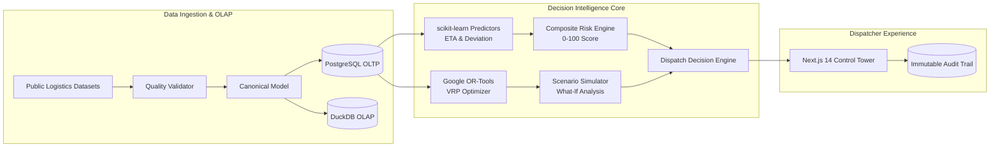

# LastMile Delivery Intelligence — Technical Documentation Suite

Welcome to the comprehensive documentation suite for **LastMile Delivery Intelligence**, an enterprise-grade last-mile logistics decision-intelligence platform built for e-commerce, courier networks, on-demand food delivery, and freight operations.

---

## Documentation Navigation

| Document | Primary Focus | Key Contents |
| :--- | :--- | :--- |
| **[System Architecture](ARCHITECTURE.md)** | Technical Architecture & System Design | Modular monolith structure, FastAPI backend, Next.js 14 frontend, Google OR-Tools VRP engine, DuckDB OLAP, PostgreSQL OLTP, component flow diagrams, data pipeline. |
| **[User Flow & Operational Journeys](USER_FLOW_DIAGRAM.md)** | UX & Dispatcher Operations | Human-in-the-loop dispatch loop (`OBSERVE → PREDICT → DIAGNOSE → OPTIMIZE → SIMULATE → DECIDE → LEARN`), triage flows, What-If simulation workflow, audit logging. |
| **[Product Specification](PRODUCT.md)** | Product Strategy & Requirements | Logistics economic problem, target user personas, core functional capabilities, non-goals, measurable KPIs, risk management, and roadmap. |
| **[Data Engineering & Provenance](DATA.md)** | Data Pipeline & Provenance | Amazon Last Mile Challenge & Mendeley Planned-vs-Actual datasets, Canonical Delivery Model, 7-stage validation pipeline, DuckDB Parquet storage, synthetic fallback policy. |
| **[Machine Learning Architecture](ML.md)** | Predictive Modeling & Risk Scoring | Canonical 9-feature vector, dispatch-time temporal leakage rules, GradientBoosting ETA delay predictor, RandomForest route deviation classifier, composite risk formula. |
| **[Route Optimization Specification](OPTIMIZATION.md)** | Mathematical VRP & Heuristics | Vehicle Routing Problem (VRP) & TSP formulation, multi-objective cost function, Haversine distance matrix, Google OR-Tools constraint solver, what-if scenario engine. |
| **[Model & System Evaluation](EVALUATION.md)** | Validation & Benchmarking | Real vs synthetic evaluation protocols, metric honesty discipline, regression & classification metrics, OR-Tools benchmark comparison, evaluation scripts. |
| **[REST API Specification](API.md)** | Interface Reference | Complete REST API endpoint reference, OpenAPI schema definitions, request/response JSON payloads, status codes, query parameters. |
| **[Limitations & Boundary Conditions](LIMITATIONS.md)** | System Constraints & Edge Cases | Dataset boundaries, solver heuristic cutoffs, Haversine road-network caveats, traffic representation, and production readiness roadmap. |

---

## Platform Overview



---

## Architectural Principles

1. **Deterministic Optimization + Statistical Prediction**: Machine learning predicts uncertain environmental variables (driver delay, sequence deviation probability), while exact deterministic algorithms (Google OR-Tools) solve routing constraints.
2. **Metric Honesty**: When real public benchmark datasets are absent, the system operates in explicit `synthetic_demo` mode, returning `evaluation_status: "insufficient_data"` and `metrics: null` rather than displaying fabricated numbers.
3. **Dispatch-Time Temporal Leakage Discipline**: All feature extraction strictly uses variables known at departure time $T_0$. Actual outcomes (actual arrival, actual distance) are strictly forbidden from predictive features.
4. **Human-in-the-Loop Auditability**: Automated algorithms provide ranked recommendations with transparent evidence snapshots. Dispatchers retain decision authority (Accept, Reject, Dismiss), and all decisions are recorded in an append-only audit trail.

---

## Repository Map

```text
├── backend/
│   ├── app/
│   │   ├── analytics/     # Fleet KPI computation & Kendall Tau deviation analytics
│   │   ├── api/           # FastAPI REST routes (routes, deliveries, models, audit, etc.)
│   │   ├── core/          # App configuration, database sessions, environment settings
│   │   ├── decisions/     # Rule-based dispatch decision engine
│   │   ├── ingestion/     # Dataset parsers, canonical transformers, quality validation
│   │   ├── ml/            # ETA regression, deviation classification, feature extraction
│   │   ├── models/        # SQLAlchemy ORM database models
│   │   ├── optimization/  # Google OR-Tools VRP & TSP solver
│   │   ├── risk/          # Composite delivery risk scoring engine
│   │   ├── schemas/       # Pydantic V2 validation schemas
│   │   └── simulation/    # What-If scenario simulation engine
│   ├── Dockerfile
│   └── requirements.txt
├── frontend/
│   ├── src/
│   │   ├── app/           # Next.js 14 App Router pages (10 distinct workspaces)
│   │   ├── components/    # Navigation, Control Tower Header, KPI widgets
│   │   └── lib/           # Typed API client & data fetchers
│   ├── Dockerfile
│   └── package.json
├── data/                  # Local storage for raw datasets & DuckDB analytical store
└── docs/                  # Technical documentation suite
```
