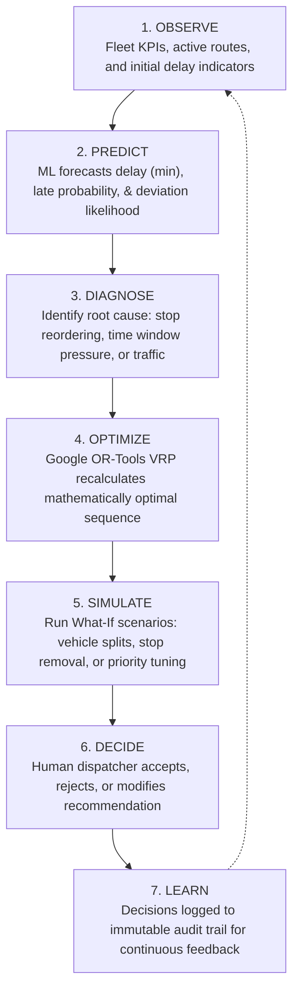
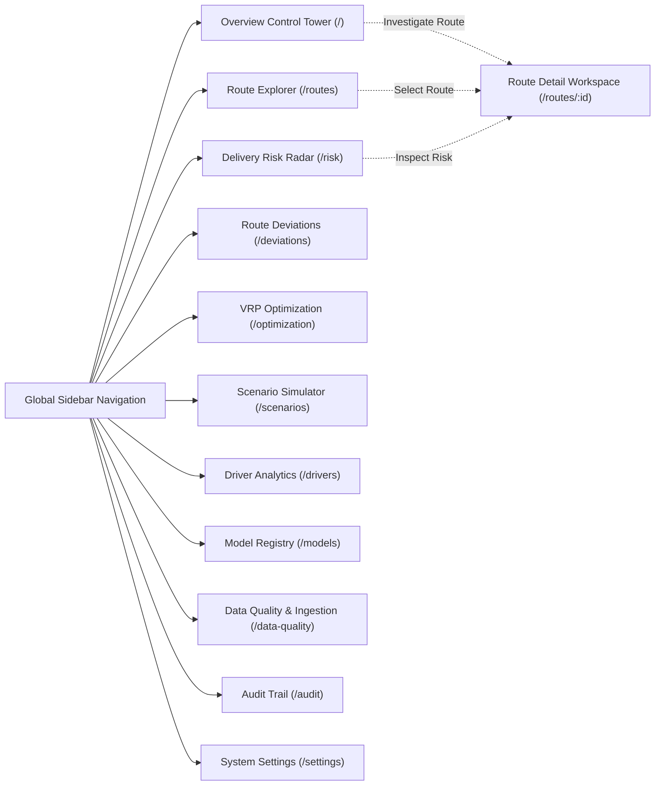
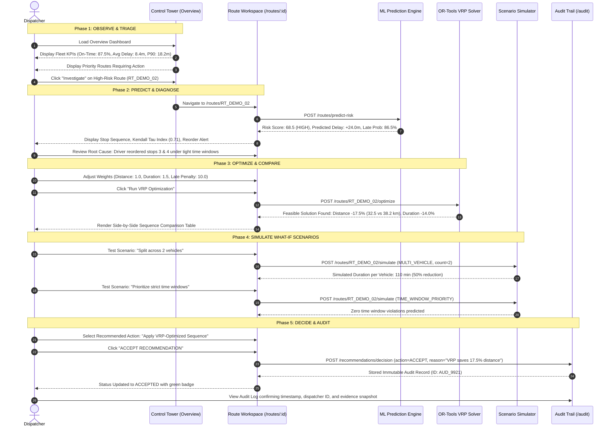
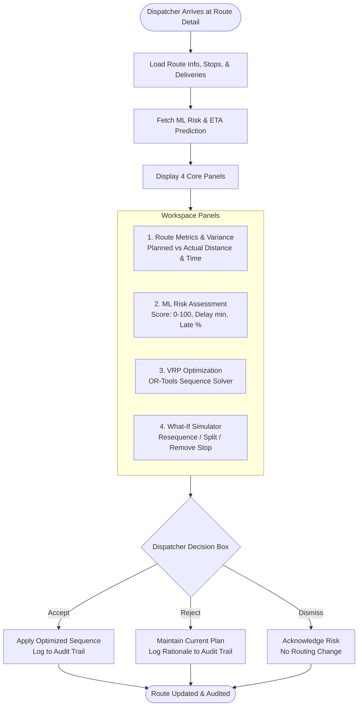
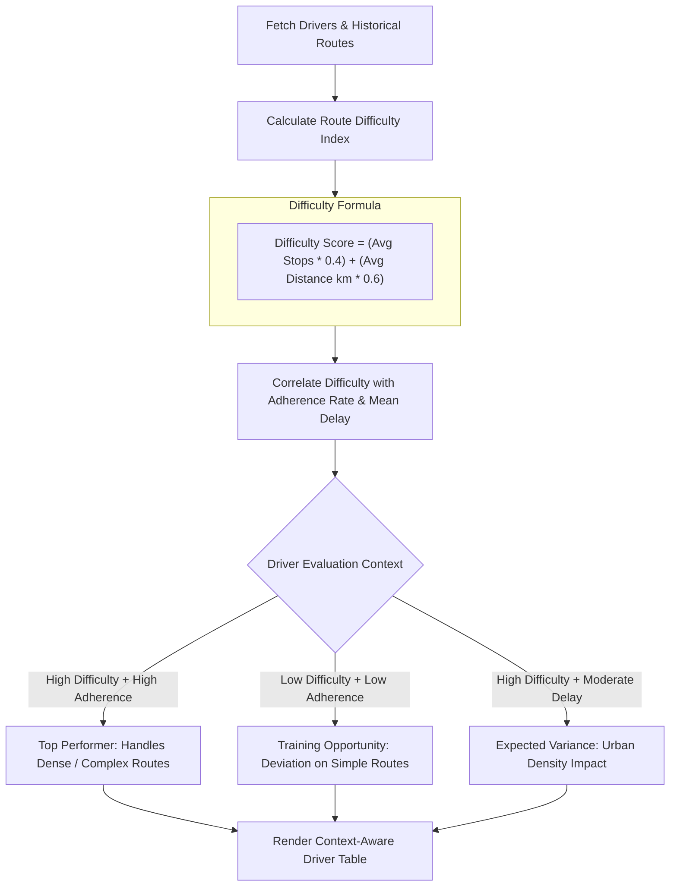
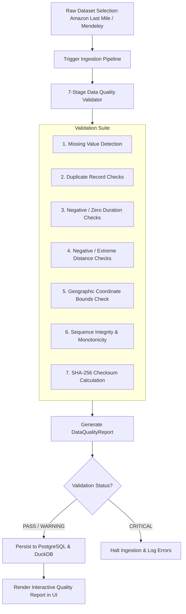

# User Flow & Operational Workflows — LastMile Delivery Intelligence

## 1. The Core Operational Decision Loop

The operational lifecycle in LastMile Delivery Intelligence follows a structured 7-stage loop:



---

## 2. User Personas

| Persona | Primary Goal | Core Workflows |
| :--- | :--- | :--- |
| **Lead Logistics Dispatcher** | Mitigate in-flight delivery delays, prevent SLA breaches, and resequence active routes. | Monitor Control Tower $\rightarrow$ Filter High-Risk Routes $\rightarrow$ Run VRP Optimization $\rightarrow$ Accept Dispatch Action. |
| **Operations Fleet Manager** | Identify recurring bottlenecks, manage driver adherence, and optimize delivery territory constraints. | Driver Analytics $\rightarrow$ Route Deviations $\rightarrow$ What-If Vehicle Split Simulations $\rightarrow$ SLA Compliance Reviews. |
| **Logistics Data Analyst** | Validate data integrity, inspect ML model calibration, and evaluate optimization savings. | Data Quality Reports $\rightarrow$ Model Registry & Drift Metrics $\rightarrow$ Dataset Ingestion Runs $\rightarrow$ Audit Log Inspection. |

---

## 3. Global Navigation & Workspace Map



---

## 4. End-to-End Dispatcher User Journey

The diagram below details how a dispatcher navigates through the application during an active delivery shift to detect, analyze, and resolve an at-risk route:



---

## 5. Detailed Screen Workflows

### 5.1 Route Investigation Workspace (`/routes/[id]`)



---

### 5.2 What-If Scenario Exploration (`/scenarios`)

```mermaid
flowchart LR
    SELECT_ROUTE[Select Active Route] --> CHOOSE_SCENARIO{Choose Scenario Type}
    
    CHOOSE_SCENARIO -->|RESEQUENCE| SCEN_1[Optimal Spatial TSP Resequencing]
    CHOOSE_SCENARIO -->|REMOVE_STOP| SCEN_2[Remove Problematic Stop / Reassign]
    CHOOSE_SCENARIO -->|MULTI_VEHICLE| SCEN_3[Split Route Across 2+ Vehicles]
    CHOOSE_SCENARIO -->|TIME_OPTIMIZED| SCEN_4[Prioritize Duration over Distance]
    CHOOSE_SCENARIO -->|TIME_WINDOW| SCEN_5[Strict SLA Time-Window Penalties]
    
    SCEN_1 --> RUN_SIM[Execute Simulation Engine]
    SCEN_2 --> RUN_SIM
    SCEN_3 --> RUN_SIM
    SCEN_4 --> RUN_SIM
    SCEN_5 --> RUN_SIM
    
    RUN_SIM --> EVAL_OUTCOME[Evaluate Delta Metrics:<br/>- Distance Saved (km)<br/>- Duration Saved (min)<br/>- Late Stops Avoided<br/>- Efficiency Gain %]
    
    EVAL_OUTCOME --> DISPATCH_ACTION[Export Solution to Dispatcher Console]
```

---

### 5.3 Driver Performance & Difficulty-Adjusted Scoring (`/drivers`)

Traditional dispatch platforms unfairly penalize drivers assigned to congested urban centers or high-density apartment complexes with short delivery windows. LastMile Delivery Intelligence introduces **Difficulty-Adjusted Driver Evaluation**:



---

### 5.4 Data Quality & Provenance Pipeline (`/data-quality`)



---

### 5.5 Decision Audit Trail & Governance (`/audit`)

```mermaid
flowchart LR
    ACTION_TRIGGERED[Dispatcher Takes Decision] --> ENRICH_RECORD[Enrich Payload with Context]
    
    subgraph AUDIT_PAYLOAD["Audit Payload Attributes"]
        A1["Timestamp UTC"]
        A2["User / Dispatcher ID"]
        A3["Route ID & External Route ID"]
        A4["Action Taken: ACCEPT / REJECT / DISMISS"]
        A5["Pre-Action Risk Score & Level"]
        A6["Predicted Delay & Deviation Probability"]
        A7["VRP Objective Weights Used"]
        A8["Written Dispatcher Justification"]
    end
    
    ENRICH_RECORD --> AUDIT_PAYLOAD
    AUDIT_PAYLOAD --> APPEND_LOG[(Append to Immutable AuditLog Table)]
    APPEND_LOG --> LIVE_AUDIT_VIEW[Surfaced in Real-time Audit Viewer (/audit)]
```
